# MI Representative Staff Disbursements 

Comparison of all 14 MI House Representative disbursements to representative staffers from FEC funds.

>> # Nature of the Review
>> Rep. Huizenga's campaign committee, Huizenga for Congress ("Campaign Committee"), may have accepted contributions from individuals employed in Rep. Huizenga's congressional office. If Rep. Huizenga failed to ensure that his campaign committee complied with applicable rules, regarding contributions from congressional employees, then he may have violated House rules, standards of conduct, and federal law.  
>> The Campaign Committee reported campaign disbursements that may not be legitimate and verifiable campaign expenditures attributable to bona fide campaign or political purposes. If Rep. Huizenga converted campaign funds from the Campaign Committee to personal use, or if Rep. Huizenga's Campaign Committee expended funds that were not attributable to bona fide campaign or political purposes, then Rep. Huizenga may have violated House rules, standards of conduct, and fedteral law.  
>> # OCE Recommendation  
>> The Board recommended that the Committee further review the above allegation concerning Rep. Huizenga because there is substantial reason to believe that Rep. Huizenga's Campaign Committee accepted contributions from individuals employed in Rep. Huizenga's congressional office.   
>> The Board recommended that the Committee further review the above allegation concerning Rep. Huizenga because tehre[sic] is substantial rea
son to believe that Rep. Huizenga's Campaign Committee reported campaign disbursements that were not legitimate and verifiable campaign expenditures attributable to bona fide campaign or political purposes. 

Source: [OCE Referral Regarding Rep. Bill Huizenga, Nov 14, 2019](https://oce.house.gov/reports/investigations/oce-referral-regarding-rep-bill-huizenga)

### Source Data:

1. [FEC Disbursement Database](https://www.fec.gov/data/disbursements/?data_type=processed&two_year_transaction_period=2020&min_date=01%2F01%2F2019&max_date=12%2F31%2F2020)
2. Staff Listings:
  - [Jack Bergman (MI-1) Staff](http://www.congress.org/congressorg/mlm/congressorg/bio/staff/?id=68717)
  - [Bill Huizenga (MI-2) Staff](http://www.congress.org/congressorg/mlm/congressorg/bio/staff/?id=135163)
  - [Justin Amash (MI-3) Staff](http://www.congress.org/congressorg/mlm/congressorg/bio/staff/?id=80123)
  - [John Moolenaar (MI-4) Staff](http://www.congress.org/congressorg/mlm/congressorg/bio/staff/?id=134609)
  - [Dan Kildee (MI-5) Staff](http://www.congress.org/congressorg/mlm/congressorg/bio/staff/?id=17560)
  - [Fred Upton (MI-6) Staff](http://www.congress.org/congressorg/mlm/congressorg/bio/staff/?id=318)
  - [Tim Walberg (MI-7) Staff](http://www.congress.org/congressorg/mlm/congressorg/bio/staff/?id=4679)
  - [Elissa Slotkin (MI-8) Staff](http://www.congress.org/congressorg/mlm/congressorg/bio/staff/?id=79580)
  - [Andy Levin (MI-9) Staff](http://www.congress.org/congressorg/mlm/congressorg/bio/staff/?id=52487)
  - [Paul Mitchell (MI-10) Staff](http://www.congress.org/congressorg/mlm/congressorg/bio/staff/?id=30093)
  - [Haley Stevens (MI-11) Staff](http://www.congress.org/congressorg/mlm/congressorg/bio/staff/?id=79589)
  - [Debbie Dingell (MI-12) Staff](http://www.congress.org/congressorg/mlm/congressorg/bio/staff/?id=28789)
  - [Rashida Tlaib (MI-13) Staff](http://www.congress.org/congressorg/mlm/congressorg/bio/staff/?id=23740)
  - [Brenda Lawrence (MI-14) Staff](http://www.congress.org/congressorg/mlm/congressorg/bio/staff/?id=16226)
  
### Corrections / Issues.

[Please open a ticket for any issues, errors, or omissions](https://github.com/RepBillHuizenga/MI_Rep_Staff_Disbursement_Analysis/issues)

## Data Analysis Setup.


```python
%matplotlib inline
from __init import *
from lookup import Congressman
```

Generate pretty plots for printing.


```python
# https://stackoverflow.com/questions/332289/how-do-you-change-the-size-of-figures-drawn-with-matplotlib#comment87590438_41717533
sns.set(
    rc={
        "axes.labelsize": 12,
        "axes.titlesize": 18,
        "figure.figsize": (11, 8.5),
        "figure.dpi": 300,
        "figure.facecolor": "w",
        "figure.edgecolor": "k",
    }
)
```

Read all of the Michigan disbursement data & reps data.


```python
df = pd.read_csv(
    filepath_or_buffer="mi_rep_all_disbursement_data.csv.gz",
    compression="gzip",
    header=0,
)
# Load all representative data. 
reps = lookup.savepoint()
# Get MI Reps.
mi = [rep for rep in reps if rep.state_abbr == "MI"]
mi_reps = [rep for rep in mi if rep.house]
mi_senate = [rep for rep in mi if rep.senate]
```

# Find all Campain Staff Disbursements

Look through each Michigan rep and their staffers and find disbursements.


```python
df2=pd.DataFrame()
for rep in mi_reps:
    for staffer in rep.staffers2.keys():
        staffer_name = HumanName(staffer)
        df_ = df[
            df.recipient_name.str.contains(",") &
            df.recipient_name.str.contains(staffer_name.first.upper()) &
            df.recipient_name.str.contains(staffer_name.last.upper()) &
            df.committee_name.str.contains(rep.last_name.upper())
        ]
        # If the staffer recieved any disbursements.
        if len(df_)>0:
            # Get the total and round to cents. Otherwise floating point numbers do weird things.
            total = np.round(df_.disbursement_amount.sum(), 2)
            print(f"{rep.state_abbr}-{rep.district}\t{rep.name}: {staffer_name}, {len(df_)} disbursements: ${total}")
            df2 = df2.append(
                other=df_,
                verify_integrity=True,
            )
df2.reset_index(inplace=True)
```

    MI-1	Jack Bergman: Amelia Burns, 24 disbursements: $20437.85
    MI-2	Bill Huizenga: Jon DeWitte, 20 disbursements: $63183.79
    MI-2	Bill Huizenga: Palmer Rafferty, 1 disbursements: $201.84
    MI-2	Bill Huizenga: Brian Patrick, 82 disbursements: $60439.51
    MI-2	Bill Huizenga: Marliss McManus, 17 disbursements: $16006.86
    MI-2	Bill Huizenga: Phil Rokus, 2 disbursements: $1747.13
    MI-2	Bill Huizenga: Matt Kooiman, 117 disbursements: $67254.43
    MI-3	Justin Amash: Poppy Nelson, 20 disbursements: $37685.17
    MI-3	Justin Amash: Matt Weibel, 13 disbursements: $40748.25
    MI-4	John Moolenaar: David Russell, 2 disbursements: $468.53
    MI-4	John Moolenaar: Cliff Burdick, 5 disbursements: $208.73
    MI-4	John Moolenaar: Chris MacArthur, 31 disbursements: $34539.73
    MI-4	John Moolenaar: Ashton Bortz, 49 disbursements: $9334.05
    MI-5	Dan Kildee: Mitchell Rivard, 11 disbursements: $6623.1
    MI-5	Dan Kildee: Ghada Alkiek, 37 disbursements: $110091.43
    MI-7	Tim Walberg: Stephen Rajzer, 57 disbursements: $98924.43
    MI-8	Elissa Slotkin: Mela Louise Norman, 44 disbursements: $109312.41
    MI-8	Elissa Slotkin: Megan Birleson, 4 disbursements: $2768.6
    MI-8	Elissa Slotkin: Hannah Lindow, 24 disbursements: $27621.2
    MI-8	Elissa Slotkin: Austin Girelli, 12 disbursements: $13544.37
    MI-8	Elissa Slotkin: Francesca Caal Skonos, 14 disbursements: $6948.29
    MI-9	Andy Levin: Abbas Alawieh, 9 disbursements: $12414.19
    MI-9	Andy Levin: Walt Herzig, 1 disbursements: $67.96
    MI-11	Haley Stevens: John Martin, 10 disbursements: $11897.34
    MI-11	Haley Stevens: Blake McCarren, 6 disbursements: $12203.64
    MI-11	Haley Stevens: Colleen Pobur, 3 disbursements: $2359.11
    MI-12	Debbie Dingell: Kevin Dollhopf, 7 disbursements: $1150.1
    MI-12	Debbie Dingell: Kelly Tebay, 1 disbursements: $407.62
    MI-13	Rashida Tlaib: Ryan Anderson, 14 disbursements: $34469.04
    MI-13	Rashida Tlaib: Andrew Goddeeris, 23 disbursements: $94188.11


# Representative Staffer Disbursements

Count and Sum total of disbursements to representative staffers. Sorted by disbursement sum.


```python
_ = df2.groupby("committee_name").agg({"disbursement_amount": ["count", "sum"]})
_.columns = ["_".join(x) for x in _.columns.ravel()]
_.columns=[c.replace("_amount", "") for c in _.columns]
_.sort_values(by=[("disbursement_sum")], inplace=True)
_
```


<div>
<style scoped>
    .dataframe tbody tr th:only-of-type {
        vertical-align: middle;
    }

    .dataframe tbody tr th {
        vertical-align: top;
    }

    .dataframe thead th {
        text-align: right;
    }
</style>
<table border="1" class="dataframe">
  <thead>
    <tr style="text-align: right;">
      <th></th>
      <th>disbursement_count</th>
      <th>disbursement_sum</th>
    </tr>
    <tr>
      <th>committee_name</th>
      <th></th>
      <th></th>
    </tr>
  </thead>
  <tbody>
    <tr>
      <th>DEBBIE DINGELL FOR CONGRESS</th>
      <td>8</td>
      <td>1557.72</td>
    </tr>
    <tr>
      <th>ANDY LEVIN FOR CONGRESS</th>
      <td>10</td>
      <td>12482.15</td>
    </tr>
    <tr>
      <th>BERGMANFORCONGRESS</th>
      <td>24</td>
      <td>20437.85</td>
    </tr>
    <tr>
      <th>HALEY STEVENS FOR CONGRESS</th>
      <td>19</td>
      <td>26460.09</td>
    </tr>
    <tr>
      <th>MOOLENAAR FOR CONGRESS</th>
      <td>87</td>
      <td>44551.04</td>
    </tr>
    <tr>
      <th>JUSTIN AMASH FOR CONGRESS</th>
      <td>33</td>
      <td>78433.42</td>
    </tr>
    <tr>
      <th>WALBERG FOR CONGRESS</th>
      <td>57</td>
      <td>98924.43</td>
    </tr>
    <tr>
      <th>FRIENDS OF DAN KILDEE</th>
      <td>48</td>
      <td>116714.53</td>
    </tr>
    <tr>
      <th>RASHIDA TLAIB FOR CONGRESS</th>
      <td>37</td>
      <td>128657.15</td>
    </tr>
    <tr>
      <th>ELISSA SLOTKIN FOR CONGRESS</th>
      <td>98</td>
      <td>160194.87</td>
    </tr>
    <tr>
      <th>HUIZENGA FOR CONGRESS</th>
      <td>239</td>
      <td>208833.56</td>
    </tr>
  </tbody>
</table>
</div>


```python
ax = _["disbursement_sum"].plot(kind='bar')
# Labels
plt.xlabel("Committee Name")
plt.ylabel("Total Value of Disbursements")
ax.yaxis.set_major_formatter(dollar_tick)
# Title & Save
fig_no=1
title = f"Fig {fig_no}. MI Representative Staff Campaign Disbursements"
plt.title(title)
plt.savefig(f"{title}.png", transparent=False, bbox_inches='tight')
```


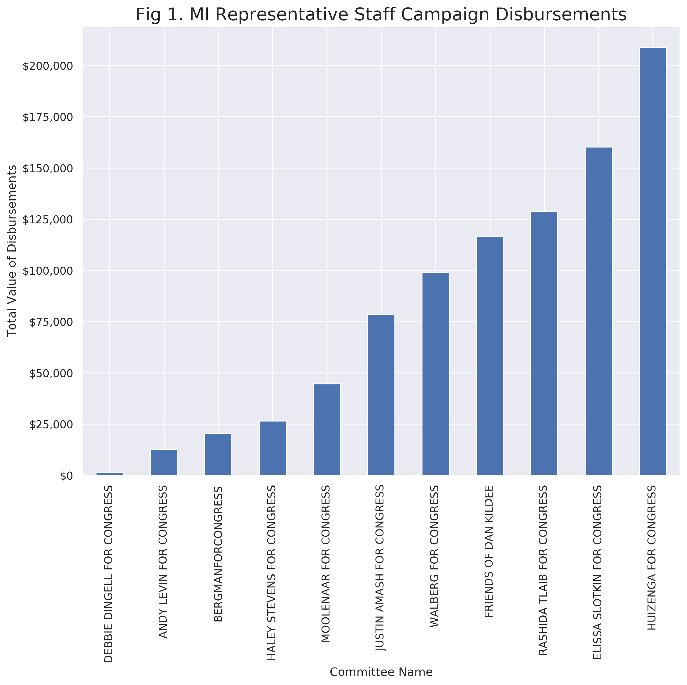


## Staffer Disbursements Grouped by Committee Name.


```python
_ = df2.groupby(['committee_name','recipient_name']).agg({"disbursement_amount": ["count", "sum"]})
_.columns = ["_".join(x) for x in _.columns.ravel()]
_.columns=[c.replace("_amount", "") for c in _.columns]
_
```


<div>
<style scoped>
    .dataframe tbody tr th:only-of-type {
        vertical-align: middle;
    }

    .dataframe tbody tr th {
        vertical-align: top;
    }

    .dataframe thead th {
        text-align: right;
    }
</style>
<table border="1" class="dataframe">
  <thead>
    <tr style="text-align: right;">
      <th></th>
      <th></th>
      <th>disbursement_count</th>
      <th>disbursement_sum</th>
    </tr>
    <tr>
      <th>committee_name</th>
      <th>recipient_name</th>
      <th></th>
      <th></th>
    </tr>
  </thead>
  <tbody>
    <tr>
      <th rowspan="2" valign="top">ANDY LEVIN FOR CONGRESS</th>
      <th>ALAWIEH, ABBAS</th>
      <td>9</td>
      <td>12414.19</td>
    </tr>
    <tr>
      <th>HERZIG, WALTER C.</th>
      <td>1</td>
      <td>67.96</td>
    </tr>
    <tr>
      <th>BERGMANFORCONGRESS</th>
      <th>BURNS, AMELIA</th>
      <td>24</td>
      <td>20437.85</td>
    </tr>
    <tr>
      <th rowspan="2" valign="top">DEBBIE DINGELL FOR CONGRESS</th>
      <th>DOLLHOPF, KEVIN</th>
      <td>7</td>
      <td>1150.10</td>
    </tr>
    <tr>
      <th>TEBAY, KELLY</th>
      <td>1</td>
      <td>407.62</td>
    </tr>
    <tr>
      <th rowspan="5" valign="top">ELISSA SLOTKIN FOR CONGRESS</th>
      <th>BIRLESON, MEGAN</th>
      <td>4</td>
      <td>2768.60</td>
    </tr>
    <tr>
      <th>CAALSKONOS, FRANCESCA</th>
      <td>14</td>
      <td>6948.29</td>
    </tr>
    <tr>
      <th>GIRELLI, AUSTIN</th>
      <td>12</td>
      <td>13544.37</td>
    </tr>
    <tr>
      <th>LINDOW, HANNAH</th>
      <td>24</td>
      <td>27621.20</td>
    </tr>
    <tr>
      <th>NORMAN, MELA LOUISE</th>
      <td>44</td>
      <td>109312.41</td>
    </tr>
    <tr>
      <th rowspan="2" valign="top">FRIENDS OF DAN KILDEE</th>
      <th>ALKIEK, GHADA</th>
      <td>37</td>
      <td>110091.43</td>
    </tr>
    <tr>
      <th>RIVARD, MITCHELL</th>
      <td>11</td>
      <td>6623.10</td>
    </tr>
    <tr>
      <th rowspan="3" valign="top">HALEY STEVENS FOR CONGRESS</th>
      <th>MARTIN, JOHN</th>
      <td>10</td>
      <td>11897.34</td>
    </tr>
    <tr>
      <th>MCCARREN, BLAKE</th>
      <td>6</td>
      <td>12203.64</td>
    </tr>
    <tr>
      <th>POBUR, COLLEEN</th>
      <td>3</td>
      <td>2359.11</td>
    </tr>
    <tr>
      <th rowspan="11" valign="top">HUIZENGA FOR CONGRESS</th>
      <th>BROWDER MCMANUS, MARLISS</th>
      <td>2</td>
      <td>488.37</td>
    </tr>
    <tr>
      <th>DEWITTE, JON</th>
      <td>7</td>
      <td>18653.56</td>
    </tr>
    <tr>
      <th>DEWITTE, JON MR.</th>
      <td>13</td>
      <td>44530.23</td>
    </tr>
    <tr>
      <th>KOOIMAN, MATT</th>
      <td>106</td>
      <td>62553.90</td>
    </tr>
    <tr>
      <th>KOOIMAN, MATT MR.</th>
      <td>4</td>
      <td>1353.32</td>
    </tr>
    <tr>
      <th>KOOIMAN-, MATT</th>
      <td>7</td>
      <td>3347.21</td>
    </tr>
    <tr>
      <th>MCMANUS, MARLISS</th>
      <td>15</td>
      <td>15518.49</td>
    </tr>
    <tr>
      <th>PATRICK, BRIAN</th>
      <td>71</td>
      <td>55176.50</td>
    </tr>
    <tr>
      <th>PATRICK-, BRIAN</th>
      <td>11</td>
      <td>5263.01</td>
    </tr>
    <tr>
      <th>RAFFERTY, PALMER</th>
      <td>1</td>
      <td>201.84</td>
    </tr>
    <tr>
      <th>ROKUS, PHILIP</th>
      <td>2</td>
      <td>1747.13</td>
    </tr>
    <tr>
      <th rowspan="2" valign="top">JUSTIN AMASH FOR CONGRESS</th>
      <th>NELSON, POPPY</th>
      <td>20</td>
      <td>37685.17</td>
    </tr>
    <tr>
      <th>WEIBEL, MATTHEW</th>
      <td>13</td>
      <td>40748.25</td>
    </tr>
    <tr>
      <th rowspan="6" valign="top">MOOLENAAR FOR CONGRESS</th>
      <th>BORTZ, ASHTON</th>
      <td>3</td>
      <td>1163.25</td>
    </tr>
    <tr>
      <th>BORTZ, ASHTON M. MS.</th>
      <td>6</td>
      <td>978.00</td>
    </tr>
    <tr>
      <th>BORTZ, ASHTON MS.</th>
      <td>40</td>
      <td>7192.80</td>
    </tr>
    <tr>
      <th>BURDICK, CLIFF</th>
      <td>5</td>
      <td>208.73</td>
    </tr>
    <tr>
      <th>MACARTHUR, CHRISTOPHER</th>
      <td>31</td>
      <td>34539.73</td>
    </tr>
    <tr>
      <th>RUSSELL, DAVID MR.</th>
      <td>2</td>
      <td>468.53</td>
    </tr>
    <tr>
      <th rowspan="2" valign="top">RASHIDA TLAIB FOR CONGRESS</th>
      <th>ANDERSON, RYAN</th>
      <td>14</td>
      <td>34469.04</td>
    </tr>
    <tr>
      <th>GODDEERIS, ANDREW</th>
      <td>23</td>
      <td>94188.11</td>
    </tr>
    <tr>
      <th rowspan="2" valign="top">WALBERG FOR CONGRESS</th>
      <th>RAJZER, STEPHEN</th>
      <td>54</td>
      <td>98567.78</td>
    </tr>
    <tr>
      <th>RAJZER, STEPHEN MR</th>
      <td>3</td>
      <td>356.65</td>
    </tr>
  </tbody>
</table>
</div>


## [Name Normalization Sidebar]

Before further analysis, normalize the recipient names.

For what ever reason, Huizenga has the most 'variety' in recipient names. Making it annoying to aggregate results.

For example:

    DEWITTE, JON                 18653.56
    DEWITTE, JON MR.             44530.23
    
"```Mr.```" splits Jon's disbursements into two. Hanlon's razor?


```python
def norm_name(recipient_name):
    # Normalize dashes added to Brian Patrick & Matt Kooiman's names.
    recipient_name = recipient_name.replace("-", "")
    # Normalize MCMANUS, MARLISS's married name.
    recipient_name = recipient_name.replace("BROWDER ", "")
    # Use HumanName to strip out titles.
    hn = HumanName(recipient_name)
    return f'{hn["last"]}, {hn["first"]}'
df2["recipient"] = df2.recipient_name.apply(norm_name)
```

## Staffer Disbursements Grouped by Committee Name, Deux


```python
_ = df2.groupby(["committee_name", "recipient"]).agg({"disbursement_amount": ["count", "sum"]})
_.columns = ["_".join(x) for x in _.columns.ravel()]
_.columns=[c.replace("_amount", "") for c in _.columns]
_
```


<div>
<style scoped>
    .dataframe tbody tr th:only-of-type {
        vertical-align: middle;
    }

    .dataframe tbody tr th {
        vertical-align: top;
    }

    .dataframe thead th {
        text-align: right;
    }
</style>
<table border="1" class="dataframe">
  <thead>
    <tr style="text-align: right;">
      <th></th>
      <th></th>
      <th>disbursement_count</th>
      <th>disbursement_sum</th>
    </tr>
    <tr>
      <th>committee_name</th>
      <th>recipient</th>
      <th></th>
      <th></th>
    </tr>
  </thead>
  <tbody>
    <tr>
      <th rowspan="2" valign="top">ANDY LEVIN FOR CONGRESS</th>
      <th>ALAWIEH, ABBAS</th>
      <td>9</td>
      <td>12414.19</td>
    </tr>
    <tr>
      <th>HERZIG, WALTER</th>
      <td>1</td>
      <td>67.96</td>
    </tr>
    <tr>
      <th>BERGMANFORCONGRESS</th>
      <th>BURNS, AMELIA</th>
      <td>24</td>
      <td>20437.85</td>
    </tr>
    <tr>
      <th rowspan="2" valign="top">DEBBIE DINGELL FOR CONGRESS</th>
      <th>DOLLHOPF, KEVIN</th>
      <td>7</td>
      <td>1150.10</td>
    </tr>
    <tr>
      <th>TEBAY, KELLY</th>
      <td>1</td>
      <td>407.62</td>
    </tr>
    <tr>
      <th rowspan="5" valign="top">ELISSA SLOTKIN FOR CONGRESS</th>
      <th>BIRLESON, MEGAN</th>
      <td>4</td>
      <td>2768.60</td>
    </tr>
    <tr>
      <th>CAALSKONOS, FRANCESCA</th>
      <td>14</td>
      <td>6948.29</td>
    </tr>
    <tr>
      <th>GIRELLI, AUSTIN</th>
      <td>12</td>
      <td>13544.37</td>
    </tr>
    <tr>
      <th>LINDOW, HANNAH</th>
      <td>24</td>
      <td>27621.20</td>
    </tr>
    <tr>
      <th>NORMAN, MELA</th>
      <td>44</td>
      <td>109312.41</td>
    </tr>
    <tr>
      <th rowspan="2" valign="top">FRIENDS OF DAN KILDEE</th>
      <th>ALKIEK, GHADA</th>
      <td>37</td>
      <td>110091.43</td>
    </tr>
    <tr>
      <th>RIVARD, MITCHELL</th>
      <td>11</td>
      <td>6623.10</td>
    </tr>
    <tr>
      <th rowspan="3" valign="top">HALEY STEVENS FOR CONGRESS</th>
      <th>MARTIN, JOHN</th>
      <td>10</td>
      <td>11897.34</td>
    </tr>
    <tr>
      <th>MCCARREN, BLAKE</th>
      <td>6</td>
      <td>12203.64</td>
    </tr>
    <tr>
      <th>POBUR, COLLEEN</th>
      <td>3</td>
      <td>2359.11</td>
    </tr>
    <tr>
      <th rowspan="6" valign="top">HUIZENGA FOR CONGRESS</th>
      <th>DEWITTE, JON</th>
      <td>20</td>
      <td>63183.79</td>
    </tr>
    <tr>
      <th>KOOIMAN, MATT</th>
      <td>117</td>
      <td>67254.43</td>
    </tr>
    <tr>
      <th>MCMANUS, MARLISS</th>
      <td>17</td>
      <td>16006.86</td>
    </tr>
    <tr>
      <th>PATRICK, BRIAN</th>
      <td>82</td>
      <td>60439.51</td>
    </tr>
    <tr>
      <th>RAFFERTY, PALMER</th>
      <td>1</td>
      <td>201.84</td>
    </tr>
    <tr>
      <th>ROKUS, PHILIP</th>
      <td>2</td>
      <td>1747.13</td>
    </tr>
    <tr>
      <th rowspan="2" valign="top">JUSTIN AMASH FOR CONGRESS</th>
      <th>NELSON, POPPY</th>
      <td>20</td>
      <td>37685.17</td>
    </tr>
    <tr>
      <th>WEIBEL, MATTHEW</th>
      <td>13</td>
      <td>40748.25</td>
    </tr>
    <tr>
      <th rowspan="4" valign="top">MOOLENAAR FOR CONGRESS</th>
      <th>BORTZ, ASHTON</th>
      <td>49</td>
      <td>9334.05</td>
    </tr>
    <tr>
      <th>BURDICK, CLIFF</th>
      <td>5</td>
      <td>208.73</td>
    </tr>
    <tr>
      <th>MACARTHUR, CHRISTOPHER</th>
      <td>31</td>
      <td>34539.73</td>
    </tr>
    <tr>
      <th>RUSSELL, DAVID</th>
      <td>2</td>
      <td>468.53</td>
    </tr>
    <tr>
      <th rowspan="2" valign="top">RASHIDA TLAIB FOR CONGRESS</th>
      <th>ANDERSON, RYAN</th>
      <td>14</td>
      <td>34469.04</td>
    </tr>
    <tr>
      <th>GODDEERIS, ANDREW</th>
      <td>23</td>
      <td>94188.11</td>
    </tr>
    <tr>
      <th>WALBERG FOR CONGRESS</th>
      <th>RAJZER, STEPHEN</th>
      <td>57</td>
      <td>98924.43</td>
    </tr>
  </tbody>
</table>
</div>


## Staffer Disbursements Sorted by Number of Disbursements.


```python
_.sort_values(by=[("disbursement_count")])
```


<div>
<style scoped>
    .dataframe tbody tr th:only-of-type {
        vertical-align: middle;
    }

    .dataframe tbody tr th {
        vertical-align: top;
    }

    .dataframe thead th {
        text-align: right;
    }
</style>
<table border="1" class="dataframe">
  <thead>
    <tr style="text-align: right;">
      <th></th>
      <th></th>
      <th>disbursement_count</th>
      <th>disbursement_sum</th>
    </tr>
    <tr>
      <th>committee_name</th>
      <th>recipient</th>
      <th></th>
      <th></th>
    </tr>
  </thead>
  <tbody>
    <tr>
      <th>ANDY LEVIN FOR CONGRESS</th>
      <th>HERZIG, WALTER</th>
      <td>1</td>
      <td>67.96</td>
    </tr>
    <tr>
      <th>DEBBIE DINGELL FOR CONGRESS</th>
      <th>TEBAY, KELLY</th>
      <td>1</td>
      <td>407.62</td>
    </tr>
    <tr>
      <th>HUIZENGA FOR CONGRESS</th>
      <th>RAFFERTY, PALMER</th>
      <td>1</td>
      <td>201.84</td>
    </tr>
    <tr>
      <th>MOOLENAAR FOR CONGRESS</th>
      <th>RUSSELL, DAVID</th>
      <td>2</td>
      <td>468.53</td>
    </tr>
    <tr>
      <th>HUIZENGA FOR CONGRESS</th>
      <th>ROKUS, PHILIP</th>
      <td>2</td>
      <td>1747.13</td>
    </tr>
    <tr>
      <th>HALEY STEVENS FOR CONGRESS</th>
      <th>POBUR, COLLEEN</th>
      <td>3</td>
      <td>2359.11</td>
    </tr>
    <tr>
      <th>ELISSA SLOTKIN FOR CONGRESS</th>
      <th>BIRLESON, MEGAN</th>
      <td>4</td>
      <td>2768.60</td>
    </tr>
    <tr>
      <th>MOOLENAAR FOR CONGRESS</th>
      <th>BURDICK, CLIFF</th>
      <td>5</td>
      <td>208.73</td>
    </tr>
    <tr>
      <th>HALEY STEVENS FOR CONGRESS</th>
      <th>MCCARREN, BLAKE</th>
      <td>6</td>
      <td>12203.64</td>
    </tr>
    <tr>
      <th>DEBBIE DINGELL FOR CONGRESS</th>
      <th>DOLLHOPF, KEVIN</th>
      <td>7</td>
      <td>1150.10</td>
    </tr>
    <tr>
      <th>ANDY LEVIN FOR CONGRESS</th>
      <th>ALAWIEH, ABBAS</th>
      <td>9</td>
      <td>12414.19</td>
    </tr>
    <tr>
      <th>HALEY STEVENS FOR CONGRESS</th>
      <th>MARTIN, JOHN</th>
      <td>10</td>
      <td>11897.34</td>
    </tr>
    <tr>
      <th>FRIENDS OF DAN KILDEE</th>
      <th>RIVARD, MITCHELL</th>
      <td>11</td>
      <td>6623.10</td>
    </tr>
    <tr>
      <th>ELISSA SLOTKIN FOR CONGRESS</th>
      <th>GIRELLI, AUSTIN</th>
      <td>12</td>
      <td>13544.37</td>
    </tr>
    <tr>
      <th>JUSTIN AMASH FOR CONGRESS</th>
      <th>WEIBEL, MATTHEW</th>
      <td>13</td>
      <td>40748.25</td>
    </tr>
    <tr>
      <th>ELISSA SLOTKIN FOR CONGRESS</th>
      <th>CAALSKONOS, FRANCESCA</th>
      <td>14</td>
      <td>6948.29</td>
    </tr>
    <tr>
      <th>RASHIDA TLAIB FOR CONGRESS</th>
      <th>ANDERSON, RYAN</th>
      <td>14</td>
      <td>34469.04</td>
    </tr>
    <tr>
      <th rowspan="2" valign="top">HUIZENGA FOR CONGRESS</th>
      <th>MCMANUS, MARLISS</th>
      <td>17</td>
      <td>16006.86</td>
    </tr>
    <tr>
      <th>DEWITTE, JON</th>
      <td>20</td>
      <td>63183.79</td>
    </tr>
    <tr>
      <th>JUSTIN AMASH FOR CONGRESS</th>
      <th>NELSON, POPPY</th>
      <td>20</td>
      <td>37685.17</td>
    </tr>
    <tr>
      <th>RASHIDA TLAIB FOR CONGRESS</th>
      <th>GODDEERIS, ANDREW</th>
      <td>23</td>
      <td>94188.11</td>
    </tr>
    <tr>
      <th>ELISSA SLOTKIN FOR CONGRESS</th>
      <th>LINDOW, HANNAH</th>
      <td>24</td>
      <td>27621.20</td>
    </tr>
    <tr>
      <th>BERGMANFORCONGRESS</th>
      <th>BURNS, AMELIA</th>
      <td>24</td>
      <td>20437.85</td>
    </tr>
    <tr>
      <th>MOOLENAAR FOR CONGRESS</th>
      <th>MACARTHUR, CHRISTOPHER</th>
      <td>31</td>
      <td>34539.73</td>
    </tr>
    <tr>
      <th>FRIENDS OF DAN KILDEE</th>
      <th>ALKIEK, GHADA</th>
      <td>37</td>
      <td>110091.43</td>
    </tr>
    <tr>
      <th>ELISSA SLOTKIN FOR CONGRESS</th>
      <th>NORMAN, MELA</th>
      <td>44</td>
      <td>109312.41</td>
    </tr>
    <tr>
      <th>MOOLENAAR FOR CONGRESS</th>
      <th>BORTZ, ASHTON</th>
      <td>49</td>
      <td>9334.05</td>
    </tr>
    <tr>
      <th>WALBERG FOR CONGRESS</th>
      <th>RAJZER, STEPHEN</th>
      <td>57</td>
      <td>98924.43</td>
    </tr>
    <tr>
      <th rowspan="2" valign="top">HUIZENGA FOR CONGRESS</th>
      <th>PATRICK, BRIAN</th>
      <td>82</td>
      <td>60439.51</td>
    </tr>
    <tr>
      <th>KOOIMAN, MATT</th>
      <td>117</td>
      <td>67254.43</td>
    </tr>
  </tbody>
</table>
</div>


## Staffer Disbursements Sorted by Value of Disbursements.


```python
_.sort_values(by=[("disbursement_sum")])
```


<div>
<style scoped>
    .dataframe tbody tr th:only-of-type {
        vertical-align: middle;
    }

    .dataframe tbody tr th {
        vertical-align: top;
    }

    .dataframe thead th {
        text-align: right;
    }
</style>
<table border="1" class="dataframe">
  <thead>
    <tr style="text-align: right;">
      <th></th>
      <th></th>
      <th>disbursement_count</th>
      <th>disbursement_sum</th>
    </tr>
    <tr>
      <th>committee_name</th>
      <th>recipient</th>
      <th></th>
      <th></th>
    </tr>
  </thead>
  <tbody>
    <tr>
      <th>ANDY LEVIN FOR CONGRESS</th>
      <th>HERZIG, WALTER</th>
      <td>1</td>
      <td>67.96</td>
    </tr>
    <tr>
      <th>HUIZENGA FOR CONGRESS</th>
      <th>RAFFERTY, PALMER</th>
      <td>1</td>
      <td>201.84</td>
    </tr>
    <tr>
      <th>MOOLENAAR FOR CONGRESS</th>
      <th>BURDICK, CLIFF</th>
      <td>5</td>
      <td>208.73</td>
    </tr>
    <tr>
      <th>DEBBIE DINGELL FOR CONGRESS</th>
      <th>TEBAY, KELLY</th>
      <td>1</td>
      <td>407.62</td>
    </tr>
    <tr>
      <th>MOOLENAAR FOR CONGRESS</th>
      <th>RUSSELL, DAVID</th>
      <td>2</td>
      <td>468.53</td>
    </tr>
    <tr>
      <th>DEBBIE DINGELL FOR CONGRESS</th>
      <th>DOLLHOPF, KEVIN</th>
      <td>7</td>
      <td>1150.10</td>
    </tr>
    <tr>
      <th>HUIZENGA FOR CONGRESS</th>
      <th>ROKUS, PHILIP</th>
      <td>2</td>
      <td>1747.13</td>
    </tr>
    <tr>
      <th>HALEY STEVENS FOR CONGRESS</th>
      <th>POBUR, COLLEEN</th>
      <td>3</td>
      <td>2359.11</td>
    </tr>
    <tr>
      <th>ELISSA SLOTKIN FOR CONGRESS</th>
      <th>BIRLESON, MEGAN</th>
      <td>4</td>
      <td>2768.60</td>
    </tr>
    <tr>
      <th>FRIENDS OF DAN KILDEE</th>
      <th>RIVARD, MITCHELL</th>
      <td>11</td>
      <td>6623.10</td>
    </tr>
    <tr>
      <th>ELISSA SLOTKIN FOR CONGRESS</th>
      <th>CAALSKONOS, FRANCESCA</th>
      <td>14</td>
      <td>6948.29</td>
    </tr>
    <tr>
      <th>MOOLENAAR FOR CONGRESS</th>
      <th>BORTZ, ASHTON</th>
      <td>49</td>
      <td>9334.05</td>
    </tr>
    <tr>
      <th rowspan="2" valign="top">HALEY STEVENS FOR CONGRESS</th>
      <th>MARTIN, JOHN</th>
      <td>10</td>
      <td>11897.34</td>
    </tr>
    <tr>
      <th>MCCARREN, BLAKE</th>
      <td>6</td>
      <td>12203.64</td>
    </tr>
    <tr>
      <th>ANDY LEVIN FOR CONGRESS</th>
      <th>ALAWIEH, ABBAS</th>
      <td>9</td>
      <td>12414.19</td>
    </tr>
    <tr>
      <th>ELISSA SLOTKIN FOR CONGRESS</th>
      <th>GIRELLI, AUSTIN</th>
      <td>12</td>
      <td>13544.37</td>
    </tr>
    <tr>
      <th>HUIZENGA FOR CONGRESS</th>
      <th>MCMANUS, MARLISS</th>
      <td>17</td>
      <td>16006.86</td>
    </tr>
    <tr>
      <th>BERGMANFORCONGRESS</th>
      <th>BURNS, AMELIA</th>
      <td>24</td>
      <td>20437.85</td>
    </tr>
    <tr>
      <th>ELISSA SLOTKIN FOR CONGRESS</th>
      <th>LINDOW, HANNAH</th>
      <td>24</td>
      <td>27621.20</td>
    </tr>
    <tr>
      <th>RASHIDA TLAIB FOR CONGRESS</th>
      <th>ANDERSON, RYAN</th>
      <td>14</td>
      <td>34469.04</td>
    </tr>
    <tr>
      <th>MOOLENAAR FOR CONGRESS</th>
      <th>MACARTHUR, CHRISTOPHER</th>
      <td>31</td>
      <td>34539.73</td>
    </tr>
    <tr>
      <th rowspan="2" valign="top">JUSTIN AMASH FOR CONGRESS</th>
      <th>NELSON, POPPY</th>
      <td>20</td>
      <td>37685.17</td>
    </tr>
    <tr>
      <th>WEIBEL, MATTHEW</th>
      <td>13</td>
      <td>40748.25</td>
    </tr>
    <tr>
      <th rowspan="3" valign="top">HUIZENGA FOR CONGRESS</th>
      <th>PATRICK, BRIAN</th>
      <td>82</td>
      <td>60439.51</td>
    </tr>
    <tr>
      <th>DEWITTE, JON</th>
      <td>20</td>
      <td>63183.79</td>
    </tr>
    <tr>
      <th>KOOIMAN, MATT</th>
      <td>117</td>
      <td>67254.43</td>
    </tr>
    <tr>
      <th>RASHIDA TLAIB FOR CONGRESS</th>
      <th>GODDEERIS, ANDREW</th>
      <td>23</td>
      <td>94188.11</td>
    </tr>
    <tr>
      <th>WALBERG FOR CONGRESS</th>
      <th>RAJZER, STEPHEN</th>
      <td>57</td>
      <td>98924.43</td>
    </tr>
    <tr>
      <th>ELISSA SLOTKIN FOR CONGRESS</th>
      <th>NORMAN, MELA</th>
      <td>44</td>
      <td>109312.41</td>
    </tr>
    <tr>
      <th>FRIENDS OF DAN KILDEE</th>
      <th>ALKIEK, GHADA</th>
      <td>37</td>
      <td>110091.43</td>
    </tr>
  </tbody>
</table>
</div>


## Staffer Disbursements Grouped by Committee Name & Disbursement Description


```python
_ = df2.groupby(['committee_name','disbursement_description']).agg({"disbursement_amount": ["count", "sum"]})
_.columns = ["_".join(x) for x in _.columns.ravel()]
_.columns=[c.replace("_amount", "") for c in _.columns]
_
```


<div>
<style scoped>
    .dataframe tbody tr th:only-of-type {
        vertical-align: middle;
    }

    .dataframe tbody tr th {
        vertical-align: top;
    }

    .dataframe thead th {
        text-align: right;
    }
</style>
<table border="1" class="dataframe">
  <thead>
    <tr style="text-align: right;">
      <th></th>
      <th></th>
      <th>disbursement_count</th>
      <th>disbursement_sum</th>
    </tr>
    <tr>
      <th>committee_name</th>
      <th>disbursement_description</th>
      <th></th>
      <th></th>
    </tr>
  </thead>
  <tbody>
    <tr>
      <th rowspan="3" valign="top">ANDY LEVIN FOR CONGRESS</th>
      <th>EVENT SUPPLIES</th>
      <td>1</td>
      <td>67.96</td>
    </tr>
    <tr>
      <th>OFFICE SUPPLY REIMBURSEMENT</th>
      <td>1</td>
      <td>212.00</td>
    </tr>
    <tr>
      <th>PAYROLL</th>
      <td>8</td>
      <td>12202.19</td>
    </tr>
    <tr>
      <th rowspan="8" valign="top">BERGMANFORCONGRESS</th>
      <th>CAMPAIGN CONSULTING</th>
      <td>1</td>
      <td>2000.00</td>
    </tr>
    <tr>
      <th>FIELD CONSULTING</th>
      <td>6</td>
      <td>10095.00</td>
    </tr>
    <tr>
      <th>NO ITEMIZATION NECESSARY</th>
      <td>1</td>
      <td>120.41</td>
    </tr>
    <tr>
      <th>POSTAGE REIMBURSEMENT</th>
      <td>3</td>
      <td>179.49</td>
    </tr>
    <tr>
      <th>SEE BELOW</th>
      <td>2</td>
      <td>1366.79</td>
    </tr>
    <tr>
      <th>SEE MEMO ENTRIES</th>
      <td>5</td>
      <td>1116.48</td>
    </tr>
    <tr>
      <th>SEE MEMO ENTRY</th>
      <td>4</td>
      <td>559.68</td>
    </tr>
    <tr>
      <th>STRATEGY CONSULTING</th>
      <td>2</td>
      <td>5000.00</td>
    </tr>
    <tr>
      <th rowspan="2" valign="top">DEBBIE DINGELL FOR CONGRESS</th>
      <th>REIMBURSEMENT</th>
      <td>1</td>
      <td>407.62</td>
    </tr>
    <tr>
      <th>TRAVEL REIMBURSEMENT - OFFICIALLY CONNECTED</th>
      <td>7</td>
      <td>1150.10</td>
    </tr>
    <tr>
      <th rowspan="7" valign="top">ELISSA SLOTKIN FOR CONGRESS</th>
      <th>MILEAGE REIMBURSEMENT</th>
      <td>6</td>
      <td>1086.90</td>
    </tr>
    <tr>
      <th>PAYROL</th>
      <td>1</td>
      <td>2410.01</td>
    </tr>
    <tr>
      <th>PAYROLL</th>
      <td>83</td>
      <td>153271.39</td>
    </tr>
    <tr>
      <th>REIMBURSEMENT</th>
      <td>4</td>
      <td>1749.81</td>
    </tr>
    <tr>
      <th>REIMBURSEMENT (VENDORS OVER $200 AGGREGATE BELOW)</th>
      <td>2</td>
      <td>1048.71</td>
    </tr>
    <tr>
      <th>REIMBURSEMENT (VENDORS THAT AGGREGATE OVER $200 APPEAR BELOW)</th>
      <td>1</td>
      <td>443.91</td>
    </tr>
    <tr>
      <th>REIMBURSEMENT (VENDORS THAT AGGREGATE OVER $200 LISTED BELOW)</th>
      <td>1</td>
      <td>184.14</td>
    </tr>
    <tr>
      <th rowspan="18" valign="top">FRIENDS OF DAN KILDEE</th>
      <th>ADVANCE FOR PURCHASE OF FOOD FOR FUNDRAISER</th>
      <td>1</td>
      <td>434.00</td>
    </tr>
    <tr>
      <th>CAR RENTAL</th>
      <td>1</td>
      <td>182.38</td>
    </tr>
    <tr>
      <th>CONTRACT CONSULTING</th>
      <td>2</td>
      <td>3720.00</td>
    </tr>
    <tr>
      <th>CONTRACT PROFESSIONAL SERVICES</th>
      <td>1</td>
      <td>706.24</td>
    </tr>
    <tr>
      <th>EXPENSE REIMBURSEMENT</th>
      <td>2</td>
      <td>642.66</td>
    </tr>
    <tr>
      <th>FOOD FOR OFFICE OPEN HOUSE</th>
      <td>1</td>
      <td>42.47</td>
    </tr>
    <tr>
      <th>FUEL REIMBURSEMENT FOR CAMPAIGN APPEARANCES</th>
      <td>1</td>
      <td>181.30</td>
    </tr>
    <tr>
      <th>FUNDRAISER SUPPLIES</th>
      <td>1</td>
      <td>45.96</td>
    </tr>
    <tr>
      <th>FUNDRAISING CONSULTING</th>
      <td>14</td>
      <td>39166.00</td>
    </tr>
    <tr>
      <th>FUNDRAISING EMPLOYEE</th>
      <td>1</td>
      <td>9841.76</td>
    </tr>
    <tr>
      <th>OFFICE SUPPLY REIMBURSEMENT</th>
      <td>1</td>
      <td>219.44</td>
    </tr>
    <tr>
      <th>PAYROLL</th>
      <td>15</td>
      <td>52892.09</td>
    </tr>
    <tr>
      <th>PAYROLL EXPENSES</th>
      <td>1</td>
      <td>7381.32</td>
    </tr>
    <tr>
      <th>REFUND FROM ACTBLUE</th>
      <td>1</td>
      <td>5.00</td>
    </tr>
    <tr>
      <th>REIMBURSEMENT FOR PRINTING EXPENSE</th>
      <td>1</td>
      <td>81.48</td>
    </tr>
    <tr>
      <th>SOCIAL MEDIA CONSULTING</th>
      <td>1</td>
      <td>786.56</td>
    </tr>
    <tr>
      <th>SUPPLIES</th>
      <td>1</td>
      <td>23.97</td>
    </tr>
    <tr>
      <th>TRAVEL EXPENSE REIMBURSEMENT</th>
      <td>2</td>
      <td>361.90</td>
    </tr>
    <tr>
      <th rowspan="4" valign="top">HALEY STEVENS FOR CONGRESS</th>
      <th>MILEAGE</th>
      <td>1</td>
      <td>327.70</td>
    </tr>
    <tr>
      <th>REIMBURSEMENT - TRAVEL</th>
      <td>1</td>
      <td>1775.56</td>
    </tr>
    <tr>
      <th>SALARY</th>
      <td>16</td>
      <td>24100.98</td>
    </tr>
    <tr>
      <th>TRAVEL REIMBURSEMENT, MEMOS BELOW IF ITEMIZED</th>
      <td>1</td>
      <td>255.85</td>
    </tr>
    <tr>
      <th rowspan="27" valign="top">HUIZENGA FOR CONGRESS</th>
      <th>ADMINISTRATION SERVICES</th>
      <td>5</td>
      <td>2500.00</td>
    </tr>
    <tr>
      <th>ADMINISTRATIVE EXPENSE</th>
      <td>2</td>
      <td>1000.00</td>
    </tr>
    <tr>
      <th>CAMPAIGN BREAKFAST MEETING</th>
      <td>1</td>
      <td>39.47</td>
    </tr>
    <tr>
      <th>CAMPAIGN CONSULTANT</th>
      <td>51</td>
      <td>30837.98</td>
    </tr>
    <tr>
      <th>CAMPAIGN CONSULTING</th>
      <td>3</td>
      <td>3000.00</td>
    </tr>
    <tr>
      <th>CAMPAIGN EVENT: MILEAGE REIMBURSEMENT</th>
      <td>1</td>
      <td>229.71</td>
    </tr>
    <tr>
      <th>CAMPAIGN EXPENSES</th>
      <td>5</td>
      <td>20675.85</td>
    </tr>
    <tr>
      <th>CONSULTING SERVICES</th>
      <td>4</td>
      <td>17354.10</td>
    </tr>
    <tr>
      <th>DIRECT MAIL PRINTING</th>
      <td>4</td>
      <td>4195.00</td>
    </tr>
    <tr>
      <th>EXPENSE REIMBURSEMENT</th>
      <td>2</td>
      <td>3114.20</td>
    </tr>
    <tr>
      <th>EXPENSES</th>
      <td>3</td>
      <td>11132.20</td>
    </tr>
    <tr>
      <th>FIELD CONSULTANT</th>
      <td>1</td>
      <td>500.00</td>
    </tr>
    <tr>
      <th>FIELD CONSULTING</th>
      <td>12</td>
      <td>9055.00</td>
    </tr>
    <tr>
      <th>FUNDRAISING CONSULTING</th>
      <td>8</td>
      <td>8966.32</td>
    </tr>
    <tr>
      <th>LABOR FOR CAMPAIGN WORKER</th>
      <td>1</td>
      <td>750.00</td>
    </tr>
    <tr>
      <th>MILEAGE EXPENSE</th>
      <td>1</td>
      <td>213.27</td>
    </tr>
    <tr>
      <th>MILEAGE REIMBURSEMENT</th>
      <td>66</td>
      <td>33288.11</td>
    </tr>
    <tr>
      <th>PERFORMANCE BONUS</th>
      <td>1</td>
      <td>1000.00</td>
    </tr>
    <tr>
      <th>PHONE EXPENSE</th>
      <td>1</td>
      <td>85.66</td>
    </tr>
    <tr>
      <th>REFRESHMENTS FOR CAMPAIGN EVENT</th>
      <td>1</td>
      <td>1100.00</td>
    </tr>
    <tr>
      <th>REIMBURSEMENT FOR MILEAGE</th>
      <td>2</td>
      <td>454.09</td>
    </tr>
    <tr>
      <th>SALARY</th>
      <td>5</td>
      <td>5510.60</td>
    </tr>
    <tr>
      <th>SALARY FOR CAMPAIGN WORKER</th>
      <td>9</td>
      <td>4500.00</td>
    </tr>
    <tr>
      <th>SEE BELOW</th>
      <td>10</td>
      <td>21454.54</td>
    </tr>
    <tr>
      <th>STRATEGY CONSULTING</th>
      <td>11</td>
      <td>13750.00</td>
    </tr>
    <tr>
      <th>TAXI &amp; FED EX SUPPLIES REIMBUR</th>
      <td>1</td>
      <td>259.99</td>
    </tr>
    <tr>
      <th>TRAVEL: MILEAGE REIMBURSEMENT</th>
      <td>27</td>
      <td>11867.47</td>
    </tr>
    <tr>
      <th rowspan="8" valign="top">JUSTIN AMASH FOR CONGRESS</th>
      <th>ADMINISTRATIVE CONSULTING</th>
      <td>14</td>
      <td>43749.66</td>
    </tr>
    <tr>
      <th>ADMINISTRATIVE/STRATEGIC SUPPORT</th>
      <td>2</td>
      <td>3436.03</td>
    </tr>
    <tr>
      <th>ADMINSTRATIVE/STRATEGIC SUPPORT</th>
      <td>2</td>
      <td>2872.06</td>
    </tr>
    <tr>
      <th>REIMBURSEMENT FOR TONER</th>
      <td>1</td>
      <td>116.58</td>
    </tr>
    <tr>
      <th>SALARY</th>
      <td>11</td>
      <td>27287.50</td>
    </tr>
    <tr>
      <th>TRAVEL</th>
      <td>1</td>
      <td>12.50</td>
    </tr>
    <tr>
      <th>TRAVEL EXPENSE--SEE MEMO</th>
      <td>1</td>
      <td>155.09</td>
    </tr>
    <tr>
      <th>TRAVEL EXPENSE-SEE MEMOS</th>
      <td>1</td>
      <td>804.00</td>
    </tr>
    <tr>
      <th rowspan="9" valign="top">MOOLENAAR FOR CONGRESS</th>
      <th>EXPENSE REIMBURSEMENT - ITEMIZED</th>
      <td>1</td>
      <td>731.62</td>
    </tr>
    <tr>
      <th>MILEAGE</th>
      <td>39</td>
      <td>14591.30</td>
    </tr>
    <tr>
      <th>MILEAGE - EXPENSES ITEMIZED</th>
      <td>2</td>
      <td>712.75</td>
    </tr>
    <tr>
      <th>MILEAGE REIMBURSEMENT</th>
      <td>19</td>
      <td>5404.05</td>
    </tr>
    <tr>
      <th>MILEAGE, EQUIPMENT - ITEMIZED</th>
      <td>1</td>
      <td>526.40</td>
    </tr>
    <tr>
      <th>MILEAGE, EXP. REIMBURSEMENT - ITEMIZED</th>
      <td>3</td>
      <td>525.25</td>
    </tr>
    <tr>
      <th>MILEAGE, EXPENSES - ITEMIZED</th>
      <td>5</td>
      <td>354.82</td>
    </tr>
    <tr>
      <th>SUPPLIES - ITEMIZED</th>
      <td>1</td>
      <td>149.60</td>
    </tr>
    <tr>
      <th>WAGES</th>
      <td>16</td>
      <td>21555.25</td>
    </tr>
    <tr>
      <th rowspan="11" valign="top">RASHIDA TLAIB FOR CONGRESS</th>
      <th>CAMPAIGN FINANCE DIRECTOR PAY 2/12 TO 2/28</th>
      <td>1</td>
      <td>2550.00</td>
    </tr>
    <tr>
      <th>FINANCE DIRECTOR PAY</th>
      <td>1</td>
      <td>675.00</td>
    </tr>
    <tr>
      <th>FUNDRAISING CONSULTATION</th>
      <td>2</td>
      <td>16000.00</td>
    </tr>
    <tr>
      <th>OFFICE SUPPLIES</th>
      <td>2</td>
      <td>164.46</td>
    </tr>
    <tr>
      <th>REIMBURSEMENT</th>
      <td>1</td>
      <td>1359.35</td>
    </tr>
    <tr>
      <th>REIMBURSEMENT - CATERING FOR DETROIT RECEPTION</th>
      <td>1</td>
      <td>218.00</td>
    </tr>
    <tr>
      <th>REIMBURSEMENT - TRAVEL</th>
      <td>1</td>
      <td>492.40</td>
    </tr>
    <tr>
      <th>REIMBURSEMENT FROM TRAVEL</th>
      <td>1</td>
      <td>1196.33</td>
    </tr>
    <tr>
      <th>REIMBURSEMENT OF TRAVEL EXPENSES</th>
      <td>1</td>
      <td>264.11</td>
    </tr>
    <tr>
      <th>RESEARCH</th>
      <td>1</td>
      <td>5125.00</td>
    </tr>
    <tr>
      <th>SALARY</th>
      <td>25</td>
      <td>100612.50</td>
    </tr>
    <tr>
      <th rowspan="13" valign="top">WALBERG FOR CONGRESS</th>
      <th>ADMINISTRATIVE/SALARY/OVERHEAD: SALARY</th>
      <td>8</td>
      <td>26055.49</td>
    </tr>
    <tr>
      <th>MILEAGE</th>
      <td>13</td>
      <td>7076.30</td>
    </tr>
    <tr>
      <th>OTHER: REIMBURSEMENT - FOOD/SUPPLIES</th>
      <td>1</td>
      <td>573.65</td>
    </tr>
    <tr>
      <th>OTHER: REIMBURSEMENT - INSURANCE</th>
      <td>1</td>
      <td>74.21</td>
    </tr>
    <tr>
      <th>OTHER: REIMBURSEMENT - SUPPLIES</th>
      <td>6</td>
      <td>1371.93</td>
    </tr>
    <tr>
      <th>OTHER: REIMBURSEMENT - SUPPLIES/FOOD</th>
      <td>3</td>
      <td>960.58</td>
    </tr>
    <tr>
      <th>OTHER: REIMBURSEMENT - TRAVEL</th>
      <td>1</td>
      <td>238.71</td>
    </tr>
    <tr>
      <th>PRE-IMBURSMENT RENTAL</th>
      <td>1</td>
      <td>82.00</td>
    </tr>
    <tr>
      <th>REIMBURSEMENT - SUPPLIES, INSURANCE</th>
      <td>1</td>
      <td>304.40</td>
    </tr>
    <tr>
      <th>REIMBURSEMENT - SUPPLIES/POSTAGE/INSURANCE</th>
      <td>1</td>
      <td>214.20</td>
    </tr>
    <tr>
      <th>SALARY</th>
      <td>11</td>
      <td>53639.06</td>
    </tr>
    <tr>
      <th>SALARY - BONUS</th>
      <td>1</td>
      <td>5000.00</td>
    </tr>
    <tr>
      <th>TRAVEL: MILEAGE</th>
      <td>9</td>
      <td>3333.90</td>
    </tr>
  </tbody>
</table>
</div>


# Payroll vs Non-Payroll Staff Disbursements

As shown in ```Fig 1.```, Huizenga's staff disbursements is inline (but still higher) with disbursements taken by other Michigan representative staffers. However all other campaigns have considerable spending for salary/payroll.

For the purposes of this analysis "Salary" & "Payroll" are synonymous.


```python
# Determine if a disbursement 
def ispayroll(disbursement_description):
    if "SALARY" in disbursement_description:
        return "Payroll"
    # Edgecase for a typo.
    if "PAYROL" in disbursement_description:
        return "Payroll"
    return "Non-Payroll"
# Force disbursement_description to a string. 
df2["disbursement_description"] = df2.disbursement_description.apply(str)
# Add payroll column.
df2["payroll"] = df2.disbursement_description.apply(ispayroll)
```

## Payroll vs Non Payroll Staff Disbursements, Grouped by Committee Name


```python
_ = df2.groupby(['committee_name', "payroll"]).agg({"disbursement_amount": ["count", "sum"]})
_.columns = ["_".join(x) for x in _.columns.ravel()]
_.columns=[c.replace("_amount", "") for c in _.columns]
_
```


<div>
<style scoped>
    .dataframe tbody tr th:only-of-type {
        vertical-align: middle;
    }

    .dataframe tbody tr th {
        vertical-align: top;
    }

    .dataframe thead th {
        text-align: right;
    }
</style>
<table border="1" class="dataframe">
  <thead>
    <tr style="text-align: right;">
      <th></th>
      <th></th>
      <th>disbursement_count</th>
      <th>disbursement_sum</th>
    </tr>
    <tr>
      <th>committee_name</th>
      <th>payroll</th>
      <th></th>
      <th></th>
    </tr>
  </thead>
  <tbody>
    <tr>
      <th rowspan="2" valign="top">ANDY LEVIN FOR CONGRESS</th>
      <th>Non-Payroll</th>
      <td>2</td>
      <td>279.96</td>
    </tr>
    <tr>
      <th>Payroll</th>
      <td>8</td>
      <td>12202.19</td>
    </tr>
    <tr>
      <th>BERGMANFORCONGRESS</th>
      <th>Non-Payroll</th>
      <td>24</td>
      <td>20437.85</td>
    </tr>
    <tr>
      <th>DEBBIE DINGELL FOR CONGRESS</th>
      <th>Non-Payroll</th>
      <td>8</td>
      <td>1557.72</td>
    </tr>
    <tr>
      <th rowspan="2" valign="top">ELISSA SLOTKIN FOR CONGRESS</th>
      <th>Non-Payroll</th>
      <td>14</td>
      <td>4513.47</td>
    </tr>
    <tr>
      <th>Payroll</th>
      <td>84</td>
      <td>155681.40</td>
    </tr>
    <tr>
      <th rowspan="2" valign="top">FRIENDS OF DAN KILDEE</th>
      <th>Non-Payroll</th>
      <td>32</td>
      <td>56441.12</td>
    </tr>
    <tr>
      <th>Payroll</th>
      <td>16</td>
      <td>60273.41</td>
    </tr>
    <tr>
      <th rowspan="2" valign="top">HALEY STEVENS FOR CONGRESS</th>
      <th>Non-Payroll</th>
      <td>3</td>
      <td>2359.11</td>
    </tr>
    <tr>
      <th>Payroll</th>
      <td>16</td>
      <td>24100.98</td>
    </tr>
    <tr>
      <th rowspan="2" valign="top">HUIZENGA FOR CONGRESS</th>
      <th>Non-Payroll</th>
      <td>225</td>
      <td>198822.96</td>
    </tr>
    <tr>
      <th>Payroll</th>
      <td>14</td>
      <td>10010.60</td>
    </tr>
    <tr>
      <th rowspan="2" valign="top">JUSTIN AMASH FOR CONGRESS</th>
      <th>Non-Payroll</th>
      <td>22</td>
      <td>51145.92</td>
    </tr>
    <tr>
      <th>Payroll</th>
      <td>11</td>
      <td>27287.50</td>
    </tr>
    <tr>
      <th>MOOLENAAR FOR CONGRESS</th>
      <th>Non-Payroll</th>
      <td>87</td>
      <td>44551.04</td>
    </tr>
    <tr>
      <th rowspan="2" valign="top">RASHIDA TLAIB FOR CONGRESS</th>
      <th>Non-Payroll</th>
      <td>12</td>
      <td>28044.65</td>
    </tr>
    <tr>
      <th>Payroll</th>
      <td>25</td>
      <td>100612.50</td>
    </tr>
    <tr>
      <th rowspan="2" valign="top">WALBERG FOR CONGRESS</th>
      <th>Non-Payroll</th>
      <td>37</td>
      <td>14229.88</td>
    </tr>
    <tr>
      <th>Payroll</th>
      <td>20</td>
      <td>84694.55</td>
    </tr>
  </tbody>
</table>
</div>


```python
ax = _["disbursement_sum"].unstack().plot(kind='bar', stacked=True)
# Labels
plt.xlabel("Committee Name")
plt.ylabel("Total Amount of Disbursements")
ax.yaxis.set_major_formatter(dollar_tick)
plt.legend(bbox_to_anchor=(1, 1))
# Title & Save
fig_no+=1
title = f"Fig {fig_no}. Payroll vs Non-Payroll Campaign Staff Disbursements"
plt.title(title)
plt.savefig(f"{title}.png", transparent=False, bbox_inches='tight')
```


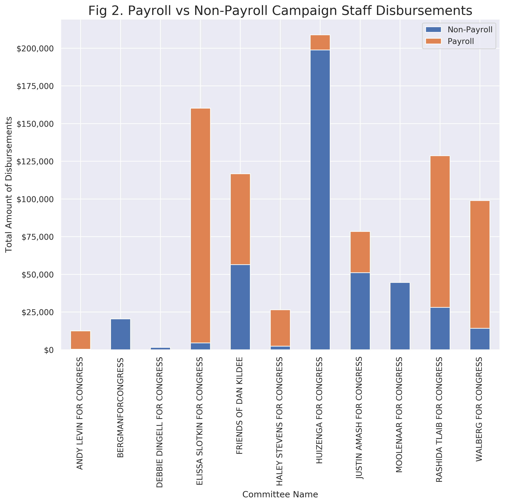


## Committee Staff Disbursements Grouped by Payroll vs Non-Payroll


```python
_ = df2.groupby(["payroll", 'committee_name']).agg({"disbursement_amount": ["count", "sum"]})
_.columns = ["_".join(x) for x in _.columns.ravel()]
_.columns=[c.replace("_amount", "") for c in _.columns]
_.sort_values(by=["payroll", "disbursement_sum"], inplace=True)
_
```


<div>
<style scoped>
    .dataframe tbody tr th:only-of-type {
        vertical-align: middle;
    }

    .dataframe tbody tr th {
        vertical-align: top;
    }

    .dataframe thead th {
        text-align: right;
    }
</style>
<table border="1" class="dataframe">
  <thead>
    <tr style="text-align: right;">
      <th></th>
      <th></th>
      <th>disbursement_count</th>
      <th>disbursement_sum</th>
    </tr>
    <tr>
      <th>payroll</th>
      <th>committee_name</th>
      <th></th>
      <th></th>
    </tr>
  </thead>
  <tbody>
    <tr>
      <th rowspan="11" valign="top">Non-Payroll</th>
      <th>ANDY LEVIN FOR CONGRESS</th>
      <td>2</td>
      <td>279.96</td>
    </tr>
    <tr>
      <th>DEBBIE DINGELL FOR CONGRESS</th>
      <td>8</td>
      <td>1557.72</td>
    </tr>
    <tr>
      <th>HALEY STEVENS FOR CONGRESS</th>
      <td>3</td>
      <td>2359.11</td>
    </tr>
    <tr>
      <th>ELISSA SLOTKIN FOR CONGRESS</th>
      <td>14</td>
      <td>4513.47</td>
    </tr>
    <tr>
      <th>WALBERG FOR CONGRESS</th>
      <td>37</td>
      <td>14229.88</td>
    </tr>
    <tr>
      <th>BERGMANFORCONGRESS</th>
      <td>24</td>
      <td>20437.85</td>
    </tr>
    <tr>
      <th>RASHIDA TLAIB FOR CONGRESS</th>
      <td>12</td>
      <td>28044.65</td>
    </tr>
    <tr>
      <th>MOOLENAAR FOR CONGRESS</th>
      <td>87</td>
      <td>44551.04</td>
    </tr>
    <tr>
      <th>JUSTIN AMASH FOR CONGRESS</th>
      <td>22</td>
      <td>51145.92</td>
    </tr>
    <tr>
      <th>FRIENDS OF DAN KILDEE</th>
      <td>32</td>
      <td>56441.12</td>
    </tr>
    <tr>
      <th>HUIZENGA FOR CONGRESS</th>
      <td>225</td>
      <td>198822.96</td>
    </tr>
    <tr>
      <th rowspan="8" valign="top">Payroll</th>
      <th>HUIZENGA FOR CONGRESS</th>
      <td>14</td>
      <td>10010.60</td>
    </tr>
    <tr>
      <th>ANDY LEVIN FOR CONGRESS</th>
      <td>8</td>
      <td>12202.19</td>
    </tr>
    <tr>
      <th>HALEY STEVENS FOR CONGRESS</th>
      <td>16</td>
      <td>24100.98</td>
    </tr>
    <tr>
      <th>JUSTIN AMASH FOR CONGRESS</th>
      <td>11</td>
      <td>27287.50</td>
    </tr>
    <tr>
      <th>FRIENDS OF DAN KILDEE</th>
      <td>16</td>
      <td>60273.41</td>
    </tr>
    <tr>
      <th>WALBERG FOR CONGRESS</th>
      <td>20</td>
      <td>84694.55</td>
    </tr>
    <tr>
      <th>RASHIDA TLAIB FOR CONGRESS</th>
      <td>25</td>
      <td>100612.50</td>
    </tr>
    <tr>
      <th>ELISSA SLOTKIN FOR CONGRESS</th>
      <td>84</td>
      <td>155681.40</td>
    </tr>
  </tbody>
</table>
</div>


```python
ax = _["disbursement_sum"].unstack().plot(kind='bar', stacked=True)
# Labels
plt.xlabel("")
plt.ylabel("Total Value of Disbursements")
ax.yaxis.set_major_formatter(dollar_tick)
# Title & Save
fig_no+=1
title = f"Fig {fig_no}. Campaign Staff Disbursements, Payroll vs Non-Payroll"
plt.title(title)
plt.legend(title="Committee Name", loc='bottom left', bbox_to_anchor=(1.0, 1))
plt.savefig(f"{title}.png", transparent=False, bbox_inches='tight')
```


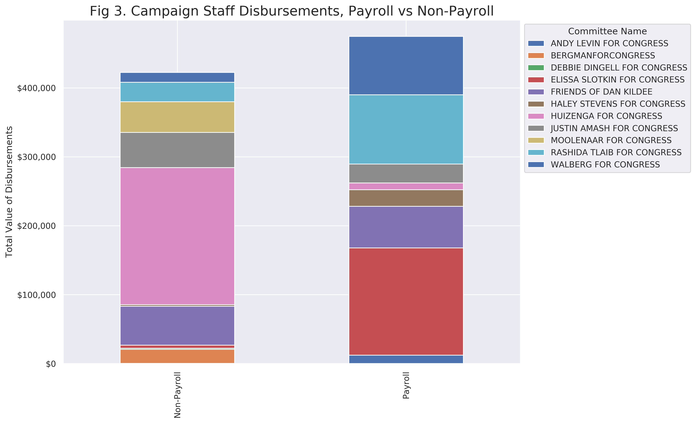


# Non-Payroll Disbursements

Looking into just disbursements made to legislative staff that were **not** for payroll purposes.

Review No. 19-2187:

> II: REP. HUIZENGA’S CAMPAIGN COMMITTEE MAY HAVE ACCEPTED CONTRIBUTIONS FROM CONGRESSIONAL STAFFERS
>> A. Applicable Law, Rules, and Standards of Conduct 
>>> 16. House Ethics Manual
>>>> “The definition of the term contribution in the FECA is quite detailed . . . **[U]nder FEC
regulations, most outlays that an individual makes on behalf of a campaign are deemed to be a
contribution to that campaign from that individual. This is so even if it is intended that the
campaign will reimburse the individual promptly.** The major exception to this rule is for
outlays that an individual makes to cover expenses that he or she incurs in traveling on behalf of
a campaign.” 10 Assuming certain travel outlays are reimbursed within specified time periods,
they will not be considered “contributions.”

## Non-Payroll Disbursements by Committee.

Sorted by disbursement total.


```python
non_payroll_df = df2[df2.payroll == "Non-Payroll"]
_ = non_payroll_df.groupby(['committee_name']).agg({"disbursement_amount": ["count", "sum"]})
_.columns = ["_".join(x) for x in _.columns.ravel()]
_.columns=[c.replace("_amount", "") for c in _.columns]
_.sort_values(by="disbursement_sum", inplace=True)
_
```


<div>
<style scoped>
    .dataframe tbody tr th:only-of-type {
        vertical-align: middle;
    }

    .dataframe tbody tr th {
        vertical-align: top;
    }

    .dataframe thead th {
        text-align: right;
    }
</style>
<table border="1" class="dataframe">
  <thead>
    <tr style="text-align: right;">
      <th></th>
      <th>disbursement_count</th>
      <th>disbursement_sum</th>
    </tr>
    <tr>
      <th>committee_name</th>
      <th></th>
      <th></th>
    </tr>
  </thead>
  <tbody>
    <tr>
      <th>ANDY LEVIN FOR CONGRESS</th>
      <td>2</td>
      <td>279.96</td>
    </tr>
    <tr>
      <th>DEBBIE DINGELL FOR CONGRESS</th>
      <td>8</td>
      <td>1557.72</td>
    </tr>
    <tr>
      <th>HALEY STEVENS FOR CONGRESS</th>
      <td>3</td>
      <td>2359.11</td>
    </tr>
    <tr>
      <th>ELISSA SLOTKIN FOR CONGRESS</th>
      <td>14</td>
      <td>4513.47</td>
    </tr>
    <tr>
      <th>WALBERG FOR CONGRESS</th>
      <td>37</td>
      <td>14229.88</td>
    </tr>
    <tr>
      <th>BERGMANFORCONGRESS</th>
      <td>24</td>
      <td>20437.85</td>
    </tr>
    <tr>
      <th>RASHIDA TLAIB FOR CONGRESS</th>
      <td>12</td>
      <td>28044.65</td>
    </tr>
    <tr>
      <th>MOOLENAAR FOR CONGRESS</th>
      <td>87</td>
      <td>44551.04</td>
    </tr>
    <tr>
      <th>JUSTIN AMASH FOR CONGRESS</th>
      <td>22</td>
      <td>51145.92</td>
    </tr>
    <tr>
      <th>FRIENDS OF DAN KILDEE</th>
      <td>32</td>
      <td>56441.12</td>
    </tr>
    <tr>
      <th>HUIZENGA FOR CONGRESS</th>
      <td>225</td>
      <td>198822.96</td>
    </tr>
  </tbody>
</table>
</div>


```python
ax = _["disbursement_sum"].plot(kind="bar")
# Labels
plt.xlabel("Committee Name")
plt.ylabel("Total Value of Disbursements")
ax.yaxis.set_major_formatter(dollar_tick)
# Title & Save
fig_no+=1
title = f"Fig {fig_no}. Non-Payroll Staff Disbursements"
plt.title(title)
plt.savefig(f"{title}.png", transparent=False, bbox_inches='tight')
```


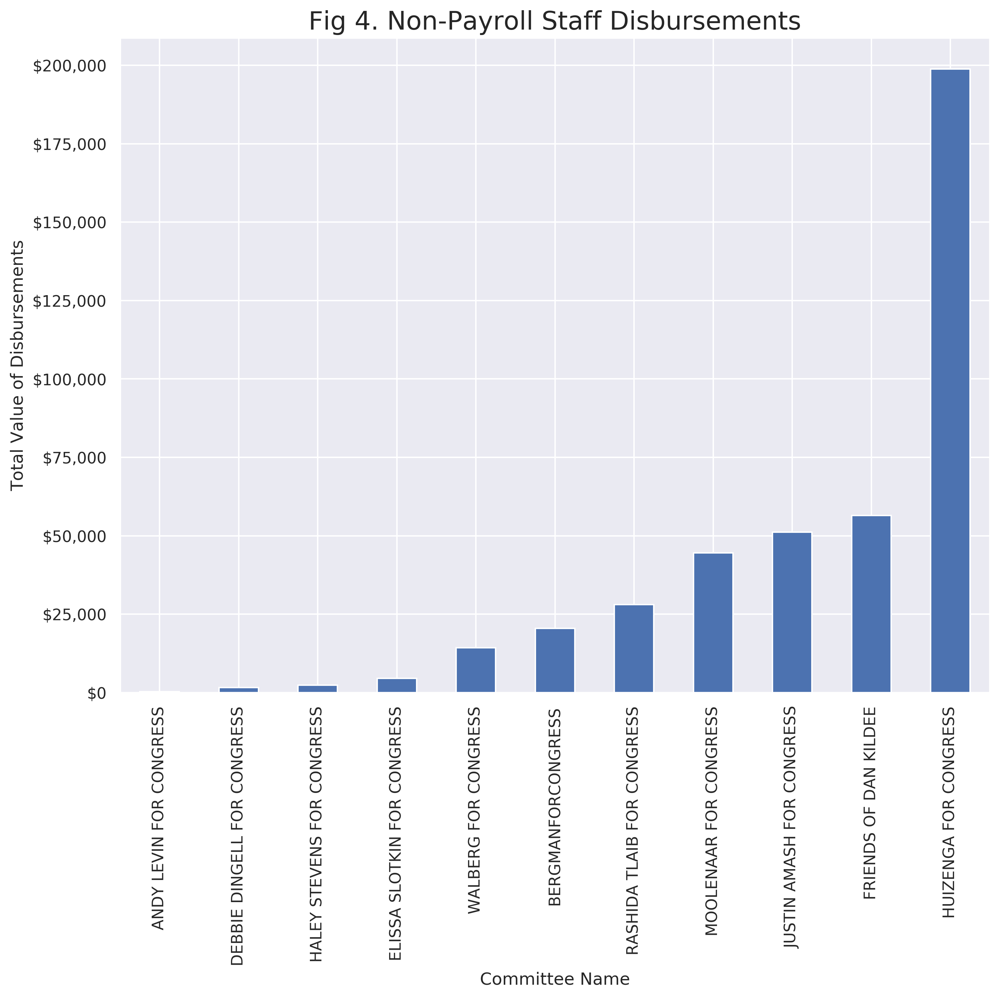


## Non-Payroll Disbursements by Recipient

Sorted by total disbursement sum.  


```python
_ = non_payroll_df.groupby(['recipient', 'committee_name']).agg({"disbursement_amount": ["count", "sum"]})
_.columns = ["_".join(x) for x in _.columns.ravel()]
_.columns=[c.replace("_amount", "") for c in _.columns]
_.sort_values(by="disbursement_sum", inplace=True)
_
```


<div>
<style scoped>
    .dataframe tbody tr th:only-of-type {
        vertical-align: middle;
    }

    .dataframe tbody tr th {
        vertical-align: top;
    }

    .dataframe thead th {
        text-align: right;
    }
</style>
<table border="1" class="dataframe">
  <thead>
    <tr style="text-align: right;">
      <th></th>
      <th></th>
      <th>disbursement_count</th>
      <th>disbursement_sum</th>
    </tr>
    <tr>
      <th>recipient</th>
      <th>committee_name</th>
      <th></th>
      <th></th>
    </tr>
  </thead>
  <tbody>
    <tr>
      <th>HERZIG, WALTER</th>
      <th>ANDY LEVIN FOR CONGRESS</th>
      <td>1</td>
      <td>67.96</td>
    </tr>
    <tr>
      <th>RAFFERTY, PALMER</th>
      <th>HUIZENGA FOR CONGRESS</th>
      <td>1</td>
      <td>201.84</td>
    </tr>
    <tr>
      <th>BURDICK, CLIFF</th>
      <th>MOOLENAAR FOR CONGRESS</th>
      <td>5</td>
      <td>208.73</td>
    </tr>
    <tr>
      <th>ALAWIEH, ABBAS</th>
      <th>ANDY LEVIN FOR CONGRESS</th>
      <td>1</td>
      <td>212.00</td>
    </tr>
    <tr>
      <th>CAALSKONOS, FRANCESCA</th>
      <th>ELISSA SLOTKIN FOR CONGRESS</th>
      <td>3</td>
      <td>330.45</td>
    </tr>
    <tr>
      <th>GIRELLI, AUSTIN</th>
      <th>ELISSA SLOTKIN FOR CONGRESS</th>
      <td>2</td>
      <td>370.00</td>
    </tr>
    <tr>
      <th>TEBAY, KELLY</th>
      <th>DEBBIE DINGELL FOR CONGRESS</th>
      <td>1</td>
      <td>407.62</td>
    </tr>
    <tr>
      <th>RUSSELL, DAVID</th>
      <th>MOOLENAAR FOR CONGRESS</th>
      <td>2</td>
      <td>468.53</td>
    </tr>
    <tr>
      <th>DOLLHOPF, KEVIN</th>
      <th>DEBBIE DINGELL FOR CONGRESS</th>
      <td>7</td>
      <td>1150.10</td>
    </tr>
    <tr>
      <th>ROKUS, PHILIP</th>
      <th>HUIZENGA FOR CONGRESS</th>
      <td>2</td>
      <td>1747.13</td>
    </tr>
    <tr>
      <th>NORMAN, MELA</th>
      <th>ELISSA SLOTKIN FOR CONGRESS</th>
      <td>4</td>
      <td>1836.35</td>
    </tr>
    <tr>
      <th>LINDOW, HANNAH</th>
      <th>ELISSA SLOTKIN FOR CONGRESS</th>
      <td>5</td>
      <td>1976.67</td>
    </tr>
    <tr>
      <th>POBUR, COLLEEN</th>
      <th>HALEY STEVENS FOR CONGRESS</th>
      <td>3</td>
      <td>2359.11</td>
    </tr>
    <tr>
      <th>GODDEERIS, ANDREW</th>
      <th>RASHIDA TLAIB FOR CONGRESS</th>
      <td>4</td>
      <td>5781.86</td>
    </tr>
    <tr>
      <th>RIVARD, MITCHELL</th>
      <th>FRIENDS OF DAN KILDEE</th>
      <td>11</td>
      <td>6623.10</td>
    </tr>
    <tr>
      <th>BORTZ, ASHTON</th>
      <th>MOOLENAAR FOR CONGRESS</th>
      <td>49</td>
      <td>9334.05</td>
    </tr>
    <tr>
      <th>NELSON, POPPY</th>
      <th>JUSTIN AMASH FOR CONGRESS</th>
      <td>9</td>
      <td>10397.67</td>
    </tr>
    <tr>
      <th>RAJZER, STEPHEN</th>
      <th>WALBERG FOR CONGRESS</th>
      <td>37</td>
      <td>14229.88</td>
    </tr>
    <tr>
      <th>MCMANUS, MARLISS</th>
      <th>HUIZENGA FOR CONGRESS</th>
      <td>17</td>
      <td>16006.86</td>
    </tr>
    <tr>
      <th>BURNS, AMELIA</th>
      <th>BERGMANFORCONGRESS</th>
      <td>24</td>
      <td>20437.85</td>
    </tr>
    <tr>
      <th>ANDERSON, RYAN</th>
      <th>RASHIDA TLAIB FOR CONGRESS</th>
      <td>8</td>
      <td>22262.79</td>
    </tr>
    <tr>
      <th>MACARTHUR, CHRISTOPHER</th>
      <th>MOOLENAAR FOR CONGRESS</th>
      <td>31</td>
      <td>34539.73</td>
    </tr>
    <tr>
      <th>WEIBEL, MATTHEW</th>
      <th>JUSTIN AMASH FOR CONGRESS</th>
      <td>13</td>
      <td>40748.25</td>
    </tr>
    <tr>
      <th>ALKIEK, GHADA</th>
      <th>FRIENDS OF DAN KILDEE</th>
      <td>21</td>
      <td>49818.02</td>
    </tr>
    <tr>
      <th>PATRICK, BRIAN</th>
      <th>HUIZENGA FOR CONGRESS</th>
      <td>78</td>
      <td>56178.91</td>
    </tr>
    <tr>
      <th>KOOIMAN, MATT</th>
      <th>HUIZENGA FOR CONGRESS</th>
      <td>107</td>
      <td>61504.43</td>
    </tr>
    <tr>
      <th>DEWITTE, JON</th>
      <th>HUIZENGA FOR CONGRESS</th>
      <td>20</td>
      <td>63183.79</td>
    </tr>
  </tbody>
</table>
</div>


```python
ax = _["disbursement_sum"].unstack().plot(kind="bar", stacked=True)
# Labels
plt.xlabel("Disbursement Recipient")
plt.ylabel("Total Value of Disbursements")
ax.yaxis.set_major_formatter(dollar_tick)
plt.legend(title="Committee Name", bbox_to_anchor=(1.0, 1))
# Title & Save
fig_no+=1
title = f"Fig {fig_no}. Non-Payroll Staff Disbursements, by Recipient"
plt.title(title)
plt.savefig(f"{title}.png", transparent=False, bbox_inches='tight')
```


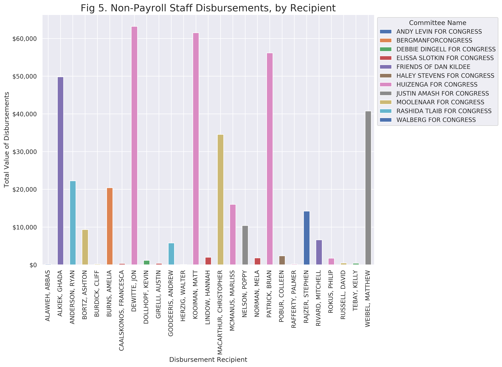


## Non-Payroll Staff Disbursement, Grouped By Committee Name & Disbursement Purpose Category


```python
_ = non_payroll_df.groupby(['committee_name', 'disbursement_purpose_category']).agg({"disbursement_amount": ["count", "sum"]})
_.columns = ["_".join(x) for x in _.columns.ravel()]
_.columns=[c.replace("_amount", "") for c in _.columns]
_
```


<div>
<style scoped>
    .dataframe tbody tr th:only-of-type {
        vertical-align: middle;
    }

    .dataframe tbody tr th {
        vertical-align: top;
    }

    .dataframe thead th {
        text-align: right;
    }
</style>
<table border="1" class="dataframe">
  <thead>
    <tr style="text-align: right;">
      <th></th>
      <th></th>
      <th>disbursement_count</th>
      <th>disbursement_sum</th>
    </tr>
    <tr>
      <th>committee_name</th>
      <th>disbursement_purpose_category</th>
      <th></th>
      <th></th>
    </tr>
  </thead>
  <tbody>
    <tr>
      <th>ANDY LEVIN FOR CONGRESS</th>
      <th>OTHER</th>
      <td>2</td>
      <td>279.96</td>
    </tr>
    <tr>
      <th rowspan="2" valign="top">BERGMANFORCONGRESS</th>
      <th>ADMINISTRATIVE</th>
      <td>3</td>
      <td>179.49</td>
    </tr>
    <tr>
      <th>OTHER</th>
      <td>21</td>
      <td>20258.36</td>
    </tr>
    <tr>
      <th rowspan="2" valign="top">DEBBIE DINGELL FOR CONGRESS</th>
      <th>OTHER</th>
      <td>1</td>
      <td>407.62</td>
    </tr>
    <tr>
      <th>TRAVEL</th>
      <td>7</td>
      <td>1150.10</td>
    </tr>
    <tr>
      <th>ELISSA SLOTKIN FOR CONGRESS</th>
      <th>OTHER</th>
      <td>14</td>
      <td>4513.47</td>
    </tr>
    <tr>
      <th rowspan="5" valign="top">FRIENDS OF DAN KILDEE</th>
      <th>ADMINISTRATIVE</th>
      <td>1</td>
      <td>182.38</td>
    </tr>
    <tr>
      <th>ADVERTISING</th>
      <td>2</td>
      <td>868.04</td>
    </tr>
    <tr>
      <th>MATERIALS</th>
      <td>5</td>
      <td>1047.03</td>
    </tr>
    <tr>
      <th>OTHER</th>
      <td>23</td>
      <td>54338.67</td>
    </tr>
    <tr>
      <th>REFUNDS</th>
      <td>1</td>
      <td>5.00</td>
    </tr>
    <tr>
      <th rowspan="2" valign="top">HALEY STEVENS FOR CONGRESS</th>
      <th>OTHER</th>
      <td>2</td>
      <td>2103.26</td>
    </tr>
    <tr>
      <th>TRAVEL</th>
      <td>1</td>
      <td>255.85</td>
    </tr>
    <tr>
      <th rowspan="3" valign="top">HUIZENGA FOR CONGRESS</th>
      <th>FUNDRAISING</th>
      <td>4</td>
      <td>4195.00</td>
    </tr>
    <tr>
      <th>MATERIALS</th>
      <td>14</td>
      <td>36221.18</td>
    </tr>
    <tr>
      <th>OTHER</th>
      <td>207</td>
      <td>158406.78</td>
    </tr>
    <tr>
      <th rowspan="2" valign="top">JUSTIN AMASH FOR CONGRESS</th>
      <th>MATERIALS</th>
      <td>2</td>
      <td>959.09</td>
    </tr>
    <tr>
      <th>OTHER</th>
      <td>20</td>
      <td>50186.83</td>
    </tr>
    <tr>
      <th rowspan="2" valign="top">MOOLENAAR FOR CONGRESS</th>
      <th>MATERIALS</th>
      <td>8</td>
      <td>1799.19</td>
    </tr>
    <tr>
      <th>OTHER</th>
      <td>79</td>
      <td>42751.85</td>
    </tr>
    <tr>
      <th rowspan="4" valign="top">RASHIDA TLAIB FOR CONGRESS</th>
      <th>ADMINISTRATIVE</th>
      <td>2</td>
      <td>164.46</td>
    </tr>
    <tr>
      <th>FUNDRAISING</th>
      <td>1</td>
      <td>218.00</td>
    </tr>
    <tr>
      <th>MATERIALS</th>
      <td>1</td>
      <td>264.11</td>
    </tr>
    <tr>
      <th>OTHER</th>
      <td>8</td>
      <td>27398.08</td>
    </tr>
    <tr>
      <th rowspan="2" valign="top">WALBERG FOR CONGRESS</th>
      <th>ADMINISTRATIVE</th>
      <td>2</td>
      <td>296.20</td>
    </tr>
    <tr>
      <th>OTHER</th>
      <td>35</td>
      <td>13933.68</td>
    </tr>
  </tbody>
</table>
</div>


```python
ax = _["disbursement_sum"].unstack().plot(kind='bar', stacked=True)
# Labels
plt.xlabel("Committee Name")
plt.ylabel("Total Value of Disbursements")
ax.yaxis.set_major_formatter(dollar_tick)
# Title & Save
fig_no+=1
title = f"Fig {fig_no}. Non-Payroll Staff Disbursement, Grouped By Committee Name & Disbursement Category"
plt.title(title)
plt.savefig(f"{title}.png", transparent=False, bbox_inches='tight')
```


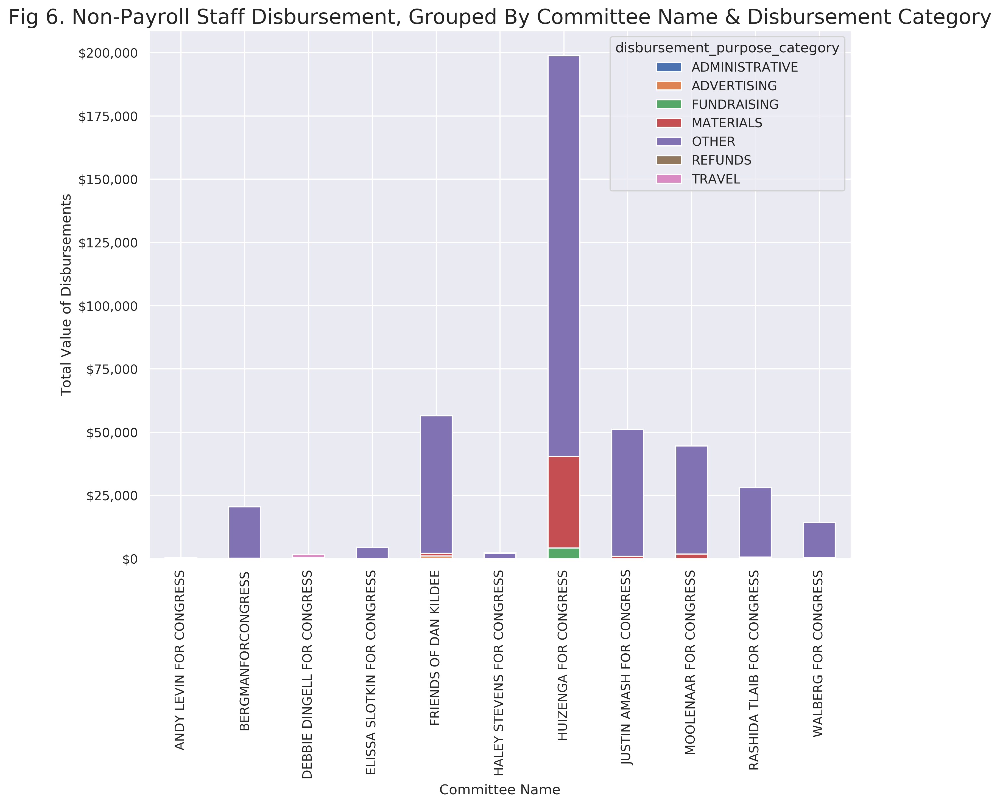


## Non-Payroll Material Staff Disbursement, Grouped By Committee Name & Disbursement Description

>> “The definition of the term contribution in the FECA is quite detailed . . . **[U]nder FEC regulations, most outlays that an individual makes on behalf of a campaign are deemed to be a contribution to that campaign from that individual.** This is so even if it is intended that the campaign will reimburse the individual promptly. The major exception to this rule is for outlays that an individual makes to cover expenses that he or she incurs in traveling on behalf of a campaign.” Assuming certain travel outlays are reimbursed within specified time periods, they will not be considered “contributions.”


```python
material_df = non_payroll_df[non_payroll_df.disbursement_purpose_category=="MATERIALS"]
_ = material_df.groupby(['committee_name','disbursement_description']).agg({"disbursement_amount": ["count", "sum"]})
_.columns = ["_".join(x) for x in _.columns.ravel()]
_.columns=[c.replace("_amount", "") for c in _.columns]
_
```


<div>
<style scoped>
    .dataframe tbody tr th:only-of-type {
        vertical-align: middle;
    }

    .dataframe tbody tr th {
        vertical-align: top;
    }

    .dataframe thead th {
        text-align: right;
    }
</style>
<table border="1" class="dataframe">
  <thead>
    <tr style="text-align: right;">
      <th></th>
      <th></th>
      <th>disbursement_count</th>
      <th>disbursement_sum</th>
    </tr>
    <tr>
      <th>committee_name</th>
      <th>disbursement_description</th>
      <th></th>
      <th></th>
    </tr>
  </thead>
  <tbody>
    <tr>
      <th rowspan="3" valign="top">FRIENDS OF DAN KILDEE</th>
      <th>EXPENSE REIMBURSEMENT</th>
      <td>2</td>
      <td>642.66</td>
    </tr>
    <tr>
      <th>FOOD FOR OFFICE OPEN HOUSE</th>
      <td>1</td>
      <td>42.47</td>
    </tr>
    <tr>
      <th>TRAVEL EXPENSE REIMBURSEMENT</th>
      <td>2</td>
      <td>361.90</td>
    </tr>
    <tr>
      <th rowspan="6" valign="top">HUIZENGA FOR CONGRESS</th>
      <th>ADMINISTRATIVE EXPENSE</th>
      <td>2</td>
      <td>1000.00</td>
    </tr>
    <tr>
      <th>CAMPAIGN EXPENSES</th>
      <td>5</td>
      <td>20675.85</td>
    </tr>
    <tr>
      <th>EXPENSE REIMBURSEMENT</th>
      <td>2</td>
      <td>3114.20</td>
    </tr>
    <tr>
      <th>EXPENSES</th>
      <td>3</td>
      <td>11132.20</td>
    </tr>
    <tr>
      <th>MILEAGE EXPENSE</th>
      <td>1</td>
      <td>213.27</td>
    </tr>
    <tr>
      <th>PHONE EXPENSE</th>
      <td>1</td>
      <td>85.66</td>
    </tr>
    <tr>
      <th rowspan="2" valign="top">JUSTIN AMASH FOR CONGRESS</th>
      <th>TRAVEL EXPENSE--SEE MEMO</th>
      <td>1</td>
      <td>155.09</td>
    </tr>
    <tr>
      <th>TRAVEL EXPENSE-SEE MEMOS</th>
      <td>1</td>
      <td>804.00</td>
    </tr>
    <tr>
      <th rowspan="3" valign="top">MOOLENAAR FOR CONGRESS</th>
      <th>EXPENSE REIMBURSEMENT - ITEMIZED</th>
      <td>1</td>
      <td>731.62</td>
    </tr>
    <tr>
      <th>MILEAGE - EXPENSES ITEMIZED</th>
      <td>2</td>
      <td>712.75</td>
    </tr>
    <tr>
      <th>MILEAGE, EXPENSES - ITEMIZED</th>
      <td>5</td>
      <td>354.82</td>
    </tr>
    <tr>
      <th>RASHIDA TLAIB FOR CONGRESS</th>
      <th>REIMBURSEMENT OF TRAVEL EXPENSES</th>
      <td>1</td>
      <td>264.11</td>
    </tr>
  </tbody>
</table>
</div>


```python
ax = _["disbursement_sum"].unstack().plot(kind='bar', stacked=True)
# Labels
plt.xlabel("Committee Name")
plt.ylabel("Total Value of Disbursements")
ax.yaxis.set_major_formatter(dollar_tick)
# Title & Save
fig_no+=1
title = f"Fig {fig_no}. Non-Payroll Staff Material Disbursement"
plt.title(title)
plt.savefig(f"{title}.png", transparent=False, bbox_inches='tight')
```


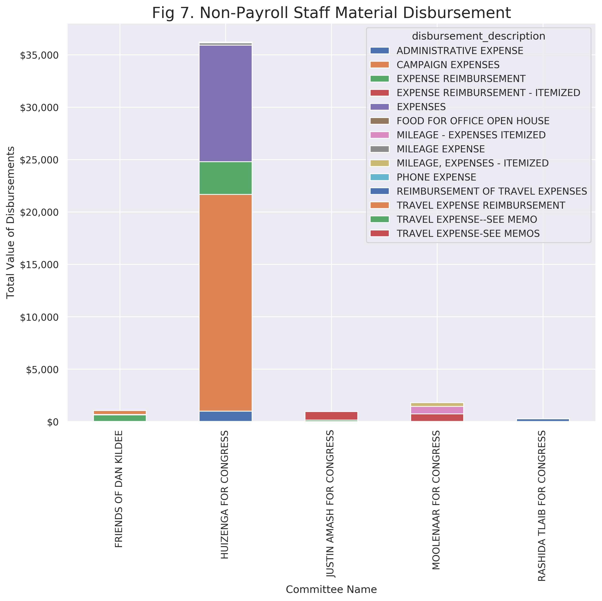


## Non-Payroll Material Staff Disbursement, Grouped By Committee Name, Recipient, & Disbursement Description


```python
_ = material_df.groupby(['committee_name','recipient', 'disbursement_description']).agg({"disbursement_amount": ["count", "sum"]})
_.columns = ["_".join(x) for x in _.columns.ravel()]
_.columns=[c.replace("_amount", "") for c in _.columns]
_
```


<div>
<style scoped>
    .dataframe tbody tr th:only-of-type {
        vertical-align: middle;
    }

    .dataframe tbody tr th {
        vertical-align: top;
    }

    .dataframe thead th {
        text-align: right;
    }
</style>
<table border="1" class="dataframe">
  <thead>
    <tr style="text-align: right;">
      <th></th>
      <th></th>
      <th></th>
      <th>disbursement_count</th>
      <th>disbursement_sum</th>
    </tr>
    <tr>
      <th>committee_name</th>
      <th>recipient</th>
      <th>disbursement_description</th>
      <th></th>
      <th></th>
    </tr>
  </thead>
  <tbody>
    <tr>
      <th rowspan="3" valign="top">FRIENDS OF DAN KILDEE</th>
      <th>ALKIEK, GHADA</th>
      <th>FOOD FOR OFFICE OPEN HOUSE</th>
      <td>1</td>
      <td>42.47</td>
    </tr>
    <tr>
      <th rowspan="2" valign="top">RIVARD, MITCHELL</th>
      <th>EXPENSE REIMBURSEMENT</th>
      <td>2</td>
      <td>642.66</td>
    </tr>
    <tr>
      <th>TRAVEL EXPENSE REIMBURSEMENT</th>
      <td>2</td>
      <td>361.90</td>
    </tr>
    <tr>
      <th rowspan="6" valign="top">HUIZENGA FOR CONGRESS</th>
      <th rowspan="2" valign="top">DEWITTE, JON</th>
      <th>CAMPAIGN EXPENSES</th>
      <td>5</td>
      <td>20675.85</td>
    </tr>
    <tr>
      <th>EXPENSES</th>
      <td>3</td>
      <td>11132.20</td>
    </tr>
    <tr>
      <th rowspan="3" valign="top">KOOIMAN, MATT</th>
      <th>ADMINISTRATIVE EXPENSE</th>
      <td>2</td>
      <td>1000.00</td>
    </tr>
    <tr>
      <th>MILEAGE EXPENSE</th>
      <td>1</td>
      <td>213.27</td>
    </tr>
    <tr>
      <th>PHONE EXPENSE</th>
      <td>1</td>
      <td>85.66</td>
    </tr>
    <tr>
      <th>MCMANUS, MARLISS</th>
      <th>EXPENSE REIMBURSEMENT</th>
      <td>2</td>
      <td>3114.20</td>
    </tr>
    <tr>
      <th rowspan="2" valign="top">JUSTIN AMASH FOR CONGRESS</th>
      <th>NELSON, POPPY</th>
      <th>TRAVEL EXPENSE--SEE MEMO</th>
      <td>1</td>
      <td>155.09</td>
    </tr>
    <tr>
      <th>WEIBEL, MATTHEW</th>
      <th>TRAVEL EXPENSE-SEE MEMOS</th>
      <td>1</td>
      <td>804.00</td>
    </tr>
    <tr>
      <th rowspan="4" valign="top">MOOLENAAR FOR CONGRESS</th>
      <th>BORTZ, ASHTON</th>
      <th>MILEAGE - EXPENSES ITEMIZED</th>
      <td>2</td>
      <td>712.75</td>
    </tr>
    <tr>
      <th>BURDICK, CLIFF</th>
      <th>MILEAGE, EXPENSES - ITEMIZED</th>
      <td>4</td>
      <td>178.71</td>
    </tr>
    <tr>
      <th rowspan="2" valign="top">MACARTHUR, CHRISTOPHER</th>
      <th>EXPENSE REIMBURSEMENT - ITEMIZED</th>
      <td>1</td>
      <td>731.62</td>
    </tr>
    <tr>
      <th>MILEAGE, EXPENSES - ITEMIZED</th>
      <td>1</td>
      <td>176.11</td>
    </tr>
    <tr>
      <th>RASHIDA TLAIB FOR CONGRESS</th>
      <th>ANDERSON, RYAN</th>
      <th>REIMBURSEMENT OF TRAVEL EXPENSES</th>
      <td>1</td>
      <td>264.11</td>
    </tr>
  </tbody>
</table>
</div>


# Misc. Disbursement Analysis

## Mileage

What campaign staff gets reimbursed most for driving.


```python
df.disbursement_description = df.disbursement_description.apply(str)
mileage_df = df2[
    df2.disbursement_description.str.contains("MILE")
]
```

### Staff mileage disbursement, Grouped by Committee Name


```python
_ = mileage_df.groupby(['committee_name']).agg({"disbursement_amount": ["count", "sum"]})
_.columns = ["_".join(x) for x in _.columns.ravel()]
_.columns=[c.replace("_amount", "") for c in _.columns]
_.sort_values(by="disbursement_sum", inplace=True)
_
```


<div>
<style scoped>
    .dataframe tbody tr th:only-of-type {
        vertical-align: middle;
    }

    .dataframe tbody tr th {
        vertical-align: top;
    }

    .dataframe thead th {
        text-align: right;
    }
</style>
<table border="1" class="dataframe">
  <thead>
    <tr style="text-align: right;">
      <th></th>
      <th>disbursement_count</th>
      <th>disbursement_sum</th>
    </tr>
    <tr>
      <th>committee_name</th>
      <th></th>
      <th></th>
    </tr>
  </thead>
  <tbody>
    <tr>
      <th>HALEY STEVENS FOR CONGRESS</th>
      <td>1</td>
      <td>327.70</td>
    </tr>
    <tr>
      <th>ELISSA SLOTKIN FOR CONGRESS</th>
      <td>6</td>
      <td>1086.90</td>
    </tr>
    <tr>
      <th>WALBERG FOR CONGRESS</th>
      <td>22</td>
      <td>10410.20</td>
    </tr>
    <tr>
      <th>MOOLENAAR FOR CONGRESS</th>
      <td>69</td>
      <td>22114.57</td>
    </tr>
    <tr>
      <th>HUIZENGA FOR CONGRESS</th>
      <td>97</td>
      <td>46052.65</td>
    </tr>
  </tbody>
</table>
</div>


```python
ax = _["disbursement_sum"].plot(kind='bar', stacked=True)
# Labels
plt.xlabel("Committee Name")
plt.ylabel("Total Value of Disbursements")
ax.yaxis.set_major_formatter(dollar_tick)
# Title & Save
fig_no+=1
title = f"Fig {fig_no}. Staff Mileage Disbursement"
plt.title(title)
plt.savefig(f"{title}.png", transparent=False, bbox_inches='tight')
```


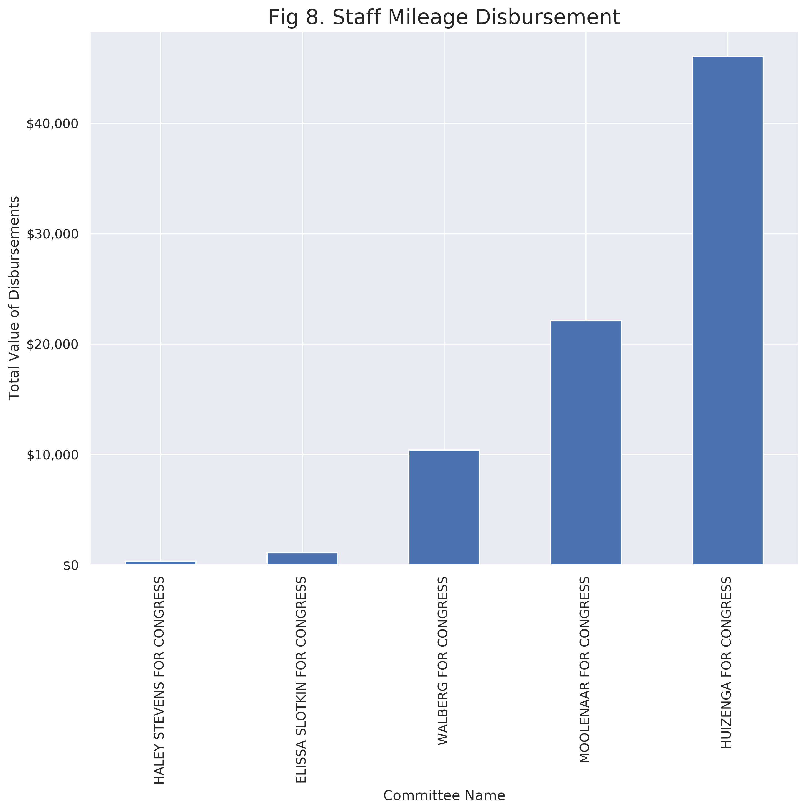


### Staff mileage disbursement, Grouped by Committee Name with Full Disbursement Description


```python
_ = mileage_df.groupby(['committee_name','disbursement_description']).agg({"disbursement_amount": ["count", "sum"]})
_.columns = ["_".join(x) for x in _.columns.ravel()]
_.columns=[c.replace("_amount", "") for c in _.columns]
_
```


<div>
<style scoped>
    .dataframe tbody tr th:only-of-type {
        vertical-align: middle;
    }

    .dataframe tbody tr th {
        vertical-align: top;
    }

    .dataframe thead th {
        text-align: right;
    }
</style>
<table border="1" class="dataframe">
  <thead>
    <tr style="text-align: right;">
      <th></th>
      <th></th>
      <th>disbursement_count</th>
      <th>disbursement_sum</th>
    </tr>
    <tr>
      <th>committee_name</th>
      <th>disbursement_description</th>
      <th></th>
      <th></th>
    </tr>
  </thead>
  <tbody>
    <tr>
      <th>ELISSA SLOTKIN FOR CONGRESS</th>
      <th>MILEAGE REIMBURSEMENT</th>
      <td>6</td>
      <td>1086.90</td>
    </tr>
    <tr>
      <th>HALEY STEVENS FOR CONGRESS</th>
      <th>MILEAGE</th>
      <td>1</td>
      <td>327.70</td>
    </tr>
    <tr>
      <th rowspan="5" valign="top">HUIZENGA FOR CONGRESS</th>
      <th>CAMPAIGN EVENT: MILEAGE REIMBURSEMENT</th>
      <td>1</td>
      <td>229.71</td>
    </tr>
    <tr>
      <th>MILEAGE EXPENSE</th>
      <td>1</td>
      <td>213.27</td>
    </tr>
    <tr>
      <th>MILEAGE REIMBURSEMENT</th>
      <td>66</td>
      <td>33288.11</td>
    </tr>
    <tr>
      <th>REIMBURSEMENT FOR MILEAGE</th>
      <td>2</td>
      <td>454.09</td>
    </tr>
    <tr>
      <th>TRAVEL: MILEAGE REIMBURSEMENT</th>
      <td>27</td>
      <td>11867.47</td>
    </tr>
    <tr>
      <th rowspan="6" valign="top">MOOLENAAR FOR CONGRESS</th>
      <th>MILEAGE</th>
      <td>39</td>
      <td>14591.30</td>
    </tr>
    <tr>
      <th>MILEAGE - EXPENSES ITEMIZED</th>
      <td>2</td>
      <td>712.75</td>
    </tr>
    <tr>
      <th>MILEAGE REIMBURSEMENT</th>
      <td>19</td>
      <td>5404.05</td>
    </tr>
    <tr>
      <th>MILEAGE, EQUIPMENT - ITEMIZED</th>
      <td>1</td>
      <td>526.40</td>
    </tr>
    <tr>
      <th>MILEAGE, EXP. REIMBURSEMENT - ITEMIZED</th>
      <td>3</td>
      <td>525.25</td>
    </tr>
    <tr>
      <th>MILEAGE, EXPENSES - ITEMIZED</th>
      <td>5</td>
      <td>354.82</td>
    </tr>
    <tr>
      <th rowspan="2" valign="top">WALBERG FOR CONGRESS</th>
      <th>MILEAGE</th>
      <td>13</td>
      <td>7076.30</td>
    </tr>
    <tr>
      <th>TRAVEL: MILEAGE</th>
      <td>9</td>
      <td>3333.90</td>
    </tr>
  </tbody>
</table>
</div>


### Staff mileage disbursement, Grouped by Recipient
Sorted by total disbursement sum.


```python
_ = mileage_df.groupby(['recipient', 'committee_name']).agg({"disbursement_amount": ["count", "sum"]})
_.columns = ["_".join(x) for x in _.columns.ravel()]
_.columns=[c.replace("_amount", "") for c in _.columns]
_.sort_values(by="disbursement_sum", inplace=True)
_
```


<div>
<style scoped>
    .dataframe tbody tr th:only-of-type {
        vertical-align: middle;
    }

    .dataframe tbody tr th {
        vertical-align: top;
    }

    .dataframe thead th {
        text-align: right;
    }
</style>
<table border="1" class="dataframe">
  <thead>
    <tr style="text-align: right;">
      <th></th>
      <th></th>
      <th>disbursement_count</th>
      <th>disbursement_sum</th>
    </tr>
    <tr>
      <th>recipient</th>
      <th>committee_name</th>
      <th></th>
      <th></th>
    </tr>
  </thead>
  <tbody>
    <tr>
      <th>NORMAN, MELA</th>
      <th>ELISSA SLOTKIN FOR CONGRESS</th>
      <td>1</td>
      <td>42.44</td>
    </tr>
    <tr>
      <th>CAALSKONOS, FRANCESCA</th>
      <th>ELISSA SLOTKIN FOR CONGRESS</th>
      <td>1</td>
      <td>97.60</td>
    </tr>
    <tr>
      <th>RAFFERTY, PALMER</th>
      <th>HUIZENGA FOR CONGRESS</th>
      <td>1</td>
      <td>201.84</td>
    </tr>
    <tr>
      <th>BURDICK, CLIFF</th>
      <th>MOOLENAAR FOR CONGRESS</th>
      <td>5</td>
      <td>208.73</td>
    </tr>
    <tr>
      <th>POBUR, COLLEEN</th>
      <th>HALEY STEVENS FOR CONGRESS</th>
      <td>1</td>
      <td>327.70</td>
    </tr>
    <tr>
      <th>GIRELLI, AUSTIN</th>
      <th>ELISSA SLOTKIN FOR CONGRESS</th>
      <td>2</td>
      <td>370.00</td>
    </tr>
    <tr>
      <th>DEWITTE, JON</th>
      <th>HUIZENGA FOR CONGRESS</th>
      <td>1</td>
      <td>374.08</td>
    </tr>
    <tr>
      <th>RUSSELL, DAVID</th>
      <th>MOOLENAAR FOR CONGRESS</th>
      <td>2</td>
      <td>468.53</td>
    </tr>
    <tr>
      <th>LINDOW, HANNAH</th>
      <th>ELISSA SLOTKIN FOR CONGRESS</th>
      <td>2</td>
      <td>576.86</td>
    </tr>
    <tr>
      <th>ROKUS, PHILIP</th>
      <th>HUIZENGA FOR CONGRESS</th>
      <td>2</td>
      <td>1747.13</td>
    </tr>
    <tr>
      <th>MCMANUS, MARLISS</th>
      <th>HUIZENGA FOR CONGRESS</th>
      <td>13</td>
      <td>8195.85</td>
    </tr>
    <tr>
      <th>PATRICK, BRIAN</th>
      <th>HUIZENGA FOR CONGRESS</th>
      <td>17</td>
      <td>8874.61</td>
    </tr>
    <tr>
      <th>BORTZ, ASHTON</th>
      <th>MOOLENAAR FOR CONGRESS</th>
      <td>49</td>
      <td>9334.05</td>
    </tr>
    <tr>
      <th>RAJZER, STEPHEN</th>
      <th>WALBERG FOR CONGRESS</th>
      <td>22</td>
      <td>10410.20</td>
    </tr>
    <tr>
      <th>MACARTHUR, CHRISTOPHER</th>
      <th>MOOLENAAR FOR CONGRESS</th>
      <td>13</td>
      <td>12103.26</td>
    </tr>
    <tr>
      <th>KOOIMAN, MATT</th>
      <th>HUIZENGA FOR CONGRESS</th>
      <td>63</td>
      <td>26659.14</td>
    </tr>
  </tbody>
</table>
</div>


```python
ax = _["disbursement_sum"].unstack().plot(kind='bar', stacked=True)
# Labels
plt.xlabel("Recipient")
plt.ylabel("Total Value of Disbursements")
ax.yaxis.set_major_formatter(dollar_tick)
# Title & Save
fig_no+=1
title = f"Fig {fig_no}. Staff Mileage Disbursement, By Staffer"
plt.title(title)
plt.savefig(f"{title}.png", transparent=False, bbox_inches='tight')
```


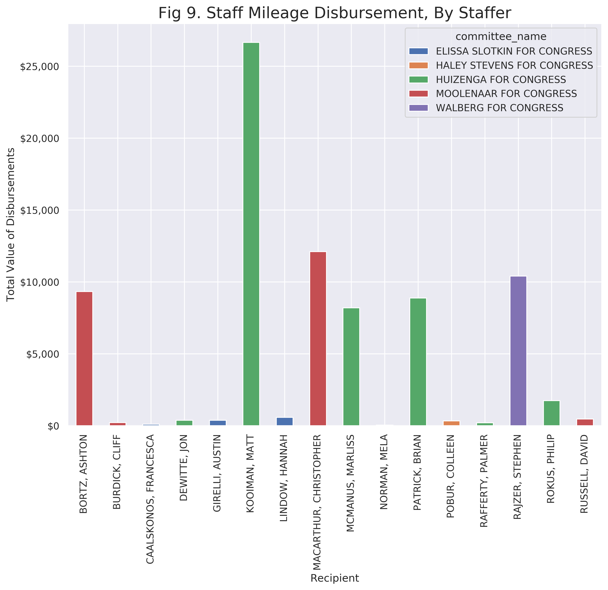


## Consulting Work

What campaign staff gets reimbursed most for "Consulting" work.


```python
df.disbursement_description = df.disbursement_description.apply(str)
consulting_df = df2[
    df2.disbursement_description.str.contains("CONSULT")
]
```

### Staff consulting disbursement, Grouped by Committee Name


```python
_ = consulting_df.groupby(['committee_name']).agg({"disbursement_amount": ["count", "sum"]})
_.columns = ["_".join(x) for x in _.columns.ravel()]
_.columns=[c.replace("_amount", "") for c in _.columns]
_.sort_values(by="disbursement_sum", inplace=True)
_
```


<div>
<style scoped>
    .dataframe tbody tr th:only-of-type {
        vertical-align: middle;
    }

    .dataframe tbody tr th {
        vertical-align: top;
    }

    .dataframe thead th {
        text-align: right;
    }
</style>
<table border="1" class="dataframe">
  <thead>
    <tr style="text-align: right;">
      <th></th>
      <th>disbursement_count</th>
      <th>disbursement_sum</th>
    </tr>
    <tr>
      <th>committee_name</th>
      <th></th>
      <th></th>
    </tr>
  </thead>
  <tbody>
    <tr>
      <th>RASHIDA TLAIB FOR CONGRESS</th>
      <td>2</td>
      <td>16000.00</td>
    </tr>
    <tr>
      <th>BERGMANFORCONGRESS</th>
      <td>9</td>
      <td>17095.00</td>
    </tr>
    <tr>
      <th>FRIENDS OF DAN KILDEE</th>
      <td>17</td>
      <td>43672.56</td>
    </tr>
    <tr>
      <th>JUSTIN AMASH FOR CONGRESS</th>
      <td>14</td>
      <td>43749.66</td>
    </tr>
    <tr>
      <th>HUIZENGA FOR CONGRESS</th>
      <td>90</td>
      <td>83463.40</td>
    </tr>
  </tbody>
</table>
</div>


```python
ax = _["disbursement_sum"].plot(kind='bar', stacked=True)
# Labels
plt.xlabel("Committee Name")
plt.ylabel("Total Value of Disbursements")
ax.yaxis.set_major_formatter(dollar_tick)
# Title & Save
fig_no+=1
title = f"Fig {fig_no}. Staff Consulting Disbursement"
plt.title(title)
plt.savefig(f"{title}.png", transparent=False, bbox_inches='tight')
```


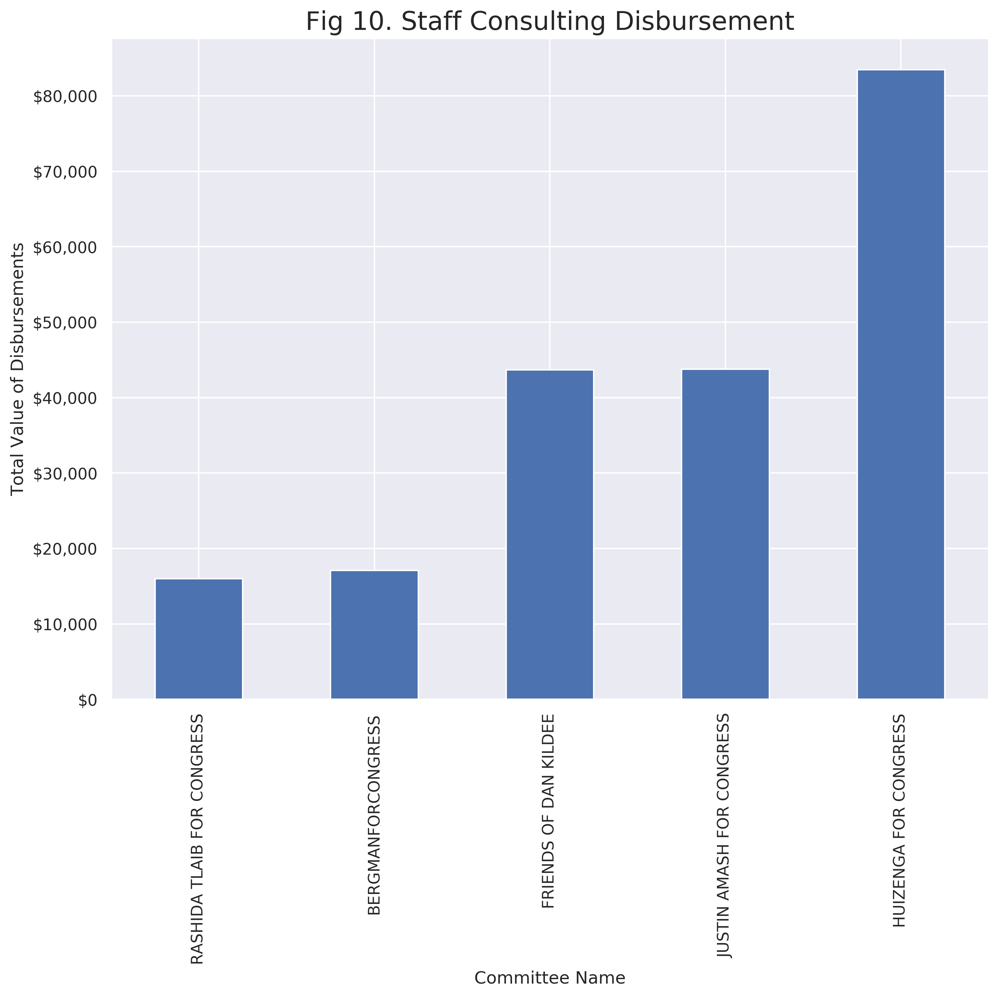


### Staff consulting disbursement, Grouped by Committee Name with Full Disbursement Description


```python
_ = consulting_df.groupby(['committee_name','disbursement_description']).agg({"disbursement_amount": ["count", "sum"]})
_.columns = ["_".join(x) for x in _.columns.ravel()]
_.columns=[c.replace("_amount", "") for c in _.columns]
_
```


<div>
<style scoped>
    .dataframe tbody tr th:only-of-type {
        vertical-align: middle;
    }

    .dataframe tbody tr th {
        vertical-align: top;
    }

    .dataframe thead th {
        text-align: right;
    }
</style>
<table border="1" class="dataframe">
  <thead>
    <tr style="text-align: right;">
      <th></th>
      <th></th>
      <th>disbursement_count</th>
      <th>disbursement_sum</th>
    </tr>
    <tr>
      <th>committee_name</th>
      <th>disbursement_description</th>
      <th></th>
      <th></th>
    </tr>
  </thead>
  <tbody>
    <tr>
      <th rowspan="3" valign="top">BERGMANFORCONGRESS</th>
      <th>CAMPAIGN CONSULTING</th>
      <td>1</td>
      <td>2000.00</td>
    </tr>
    <tr>
      <th>FIELD CONSULTING</th>
      <td>6</td>
      <td>10095.00</td>
    </tr>
    <tr>
      <th>STRATEGY CONSULTING</th>
      <td>2</td>
      <td>5000.00</td>
    </tr>
    <tr>
      <th rowspan="3" valign="top">FRIENDS OF DAN KILDEE</th>
      <th>CONTRACT CONSULTING</th>
      <td>2</td>
      <td>3720.00</td>
    </tr>
    <tr>
      <th>FUNDRAISING CONSULTING</th>
      <td>14</td>
      <td>39166.00</td>
    </tr>
    <tr>
      <th>SOCIAL MEDIA CONSULTING</th>
      <td>1</td>
      <td>786.56</td>
    </tr>
    <tr>
      <th rowspan="7" valign="top">HUIZENGA FOR CONGRESS</th>
      <th>CAMPAIGN CONSULTANT</th>
      <td>51</td>
      <td>30837.98</td>
    </tr>
    <tr>
      <th>CAMPAIGN CONSULTING</th>
      <td>3</td>
      <td>3000.00</td>
    </tr>
    <tr>
      <th>CONSULTING SERVICES</th>
      <td>4</td>
      <td>17354.10</td>
    </tr>
    <tr>
      <th>FIELD CONSULTANT</th>
      <td>1</td>
      <td>500.00</td>
    </tr>
    <tr>
      <th>FIELD CONSULTING</th>
      <td>12</td>
      <td>9055.00</td>
    </tr>
    <tr>
      <th>FUNDRAISING CONSULTING</th>
      <td>8</td>
      <td>8966.32</td>
    </tr>
    <tr>
      <th>STRATEGY CONSULTING</th>
      <td>11</td>
      <td>13750.00</td>
    </tr>
    <tr>
      <th>JUSTIN AMASH FOR CONGRESS</th>
      <th>ADMINISTRATIVE CONSULTING</th>
      <td>14</td>
      <td>43749.66</td>
    </tr>
    <tr>
      <th>RASHIDA TLAIB FOR CONGRESS</th>
      <th>FUNDRAISING CONSULTATION</th>
      <td>2</td>
      <td>16000.00</td>
    </tr>
  </tbody>
</table>
</div>


### Staff consulting disbursement, Grouped by Recipient

Sorted by total disbursement sum.


```python
_ = mileage_df.groupby(['recipient', 'committee_name']).agg({"disbursement_amount": ["count", "sum"]})
_.columns = ["_".join(x) for x in _.columns.ravel()]
_.columns=[c.replace("_amount", "") for c in _.columns]
_.sort_values(by="disbursement_sum", inplace=True)
_
```


<div>
<style scoped>
    .dataframe tbody tr th:only-of-type {
        vertical-align: middle;
    }

    .dataframe tbody tr th {
        vertical-align: top;
    }

    .dataframe thead th {
        text-align: right;
    }
</style>
<table border="1" class="dataframe">
  <thead>
    <tr style="text-align: right;">
      <th></th>
      <th></th>
      <th>disbursement_count</th>
      <th>disbursement_sum</th>
    </tr>
    <tr>
      <th>recipient</th>
      <th>committee_name</th>
      <th></th>
      <th></th>
    </tr>
  </thead>
  <tbody>
    <tr>
      <th>NORMAN, MELA</th>
      <th>ELISSA SLOTKIN FOR CONGRESS</th>
      <td>1</td>
      <td>42.44</td>
    </tr>
    <tr>
      <th>CAALSKONOS, FRANCESCA</th>
      <th>ELISSA SLOTKIN FOR CONGRESS</th>
      <td>1</td>
      <td>97.60</td>
    </tr>
    <tr>
      <th>RAFFERTY, PALMER</th>
      <th>HUIZENGA FOR CONGRESS</th>
      <td>1</td>
      <td>201.84</td>
    </tr>
    <tr>
      <th>BURDICK, CLIFF</th>
      <th>MOOLENAAR FOR CONGRESS</th>
      <td>5</td>
      <td>208.73</td>
    </tr>
    <tr>
      <th>POBUR, COLLEEN</th>
      <th>HALEY STEVENS FOR CONGRESS</th>
      <td>1</td>
      <td>327.70</td>
    </tr>
    <tr>
      <th>GIRELLI, AUSTIN</th>
      <th>ELISSA SLOTKIN FOR CONGRESS</th>
      <td>2</td>
      <td>370.00</td>
    </tr>
    <tr>
      <th>DEWITTE, JON</th>
      <th>HUIZENGA FOR CONGRESS</th>
      <td>1</td>
      <td>374.08</td>
    </tr>
    <tr>
      <th>RUSSELL, DAVID</th>
      <th>MOOLENAAR FOR CONGRESS</th>
      <td>2</td>
      <td>468.53</td>
    </tr>
    <tr>
      <th>LINDOW, HANNAH</th>
      <th>ELISSA SLOTKIN FOR CONGRESS</th>
      <td>2</td>
      <td>576.86</td>
    </tr>
    <tr>
      <th>ROKUS, PHILIP</th>
      <th>HUIZENGA FOR CONGRESS</th>
      <td>2</td>
      <td>1747.13</td>
    </tr>
    <tr>
      <th>MCMANUS, MARLISS</th>
      <th>HUIZENGA FOR CONGRESS</th>
      <td>13</td>
      <td>8195.85</td>
    </tr>
    <tr>
      <th>PATRICK, BRIAN</th>
      <th>HUIZENGA FOR CONGRESS</th>
      <td>17</td>
      <td>8874.61</td>
    </tr>
    <tr>
      <th>BORTZ, ASHTON</th>
      <th>MOOLENAAR FOR CONGRESS</th>
      <td>49</td>
      <td>9334.05</td>
    </tr>
    <tr>
      <th>RAJZER, STEPHEN</th>
      <th>WALBERG FOR CONGRESS</th>
      <td>22</td>
      <td>10410.20</td>
    </tr>
    <tr>
      <th>MACARTHUR, CHRISTOPHER</th>
      <th>MOOLENAAR FOR CONGRESS</th>
      <td>13</td>
      <td>12103.26</td>
    </tr>
    <tr>
      <th>KOOIMAN, MATT</th>
      <th>HUIZENGA FOR CONGRESS</th>
      <td>63</td>
      <td>26659.14</td>
    </tr>
  </tbody>
</table>
</div>


```python
ax = _["disbursement_sum"].unstack().plot(kind='bar', stacked=True)
# Labels
plt.xlabel("Recipient")
plt.ylabel("Total Value of Disbursements")
ax.yaxis.set_major_formatter(dollar_tick)
# Title & Save
fig_no+=1
title = f"Fig {fig_no}. Staff Consulting Disbursements, Grouped by Recipient"
plt.title(title)
plt.savefig(f"{title}.png", transparent=False, bbox_inches='tight')
```


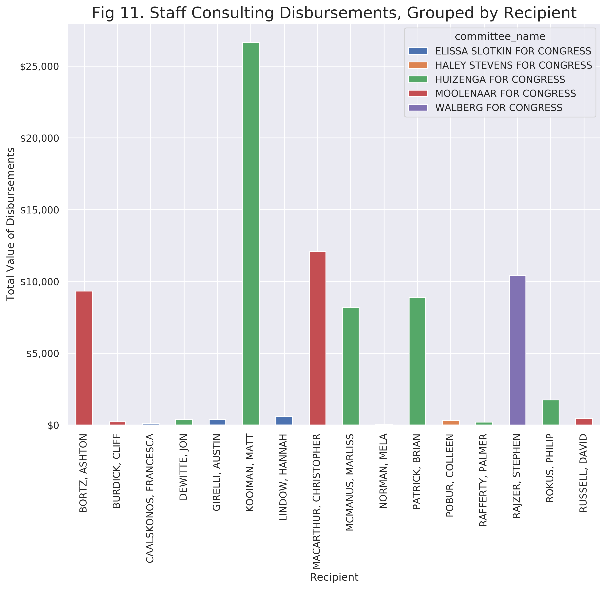


## "Other", Non-Payroll.

What campaign staff gets reimbursed most for "Other" & what disbursement purposes does each compaign count as 'Other'.


```python
df.disbursement_description = df.disbursement_description.apply(str)
non_payroll_other_df = non_payroll_df[
    non_payroll_df.disbursement_purpose_category == "OTHER"
]
```

### Non-Payroll Staff "OTHER" disbursements, Grouped by Committee Name

Sorted by total disbursement sum.


```python
_ = non_payroll_other_df.groupby(['committee_name']).agg({"disbursement_amount": ["count", "sum"]})
_.columns = ["_".join(x) for x in _.columns.ravel()]
_.columns=[c.replace("_amount", "") for c in _.columns]
_.sort_values(by="disbursement_sum", inplace=True)
_
```


<div>
<style scoped>
    .dataframe tbody tr th:only-of-type {
        vertical-align: middle;
    }

    .dataframe tbody tr th {
        vertical-align: top;
    }

    .dataframe thead th {
        text-align: right;
    }
</style>
<table border="1" class="dataframe">
  <thead>
    <tr style="text-align: right;">
      <th></th>
      <th>disbursement_count</th>
      <th>disbursement_sum</th>
    </tr>
    <tr>
      <th>committee_name</th>
      <th></th>
      <th></th>
    </tr>
  </thead>
  <tbody>
    <tr>
      <th>ANDY LEVIN FOR CONGRESS</th>
      <td>2</td>
      <td>279.96</td>
    </tr>
    <tr>
      <th>DEBBIE DINGELL FOR CONGRESS</th>
      <td>1</td>
      <td>407.62</td>
    </tr>
    <tr>
      <th>HALEY STEVENS FOR CONGRESS</th>
      <td>2</td>
      <td>2103.26</td>
    </tr>
    <tr>
      <th>ELISSA SLOTKIN FOR CONGRESS</th>
      <td>14</td>
      <td>4513.47</td>
    </tr>
    <tr>
      <th>WALBERG FOR CONGRESS</th>
      <td>35</td>
      <td>13933.68</td>
    </tr>
    <tr>
      <th>BERGMANFORCONGRESS</th>
      <td>21</td>
      <td>20258.36</td>
    </tr>
    <tr>
      <th>RASHIDA TLAIB FOR CONGRESS</th>
      <td>8</td>
      <td>27398.08</td>
    </tr>
    <tr>
      <th>MOOLENAAR FOR CONGRESS</th>
      <td>79</td>
      <td>42751.85</td>
    </tr>
    <tr>
      <th>JUSTIN AMASH FOR CONGRESS</th>
      <td>20</td>
      <td>50186.83</td>
    </tr>
    <tr>
      <th>FRIENDS OF DAN KILDEE</th>
      <td>23</td>
      <td>54338.67</td>
    </tr>
    <tr>
      <th>HUIZENGA FOR CONGRESS</th>
      <td>207</td>
      <td>158406.78</td>
    </tr>
  </tbody>
</table>
</div>


```python
ax = _["disbursement_sum"].plot(kind='bar', stacked=True)
# Labels
plt.xlabel("Committee Name")
plt.ylabel("Total Value of Disbursements")
ax.yaxis.set_major_formatter(dollar_tick)
# Title & Save
fig_no+=1
title = f"Fig {fig_no}. Non-Payroll 'Other' Disbursements"
plt.title(title)
plt.savefig(f"{title}.png", transparent=False, bbox_inches='tight')
```


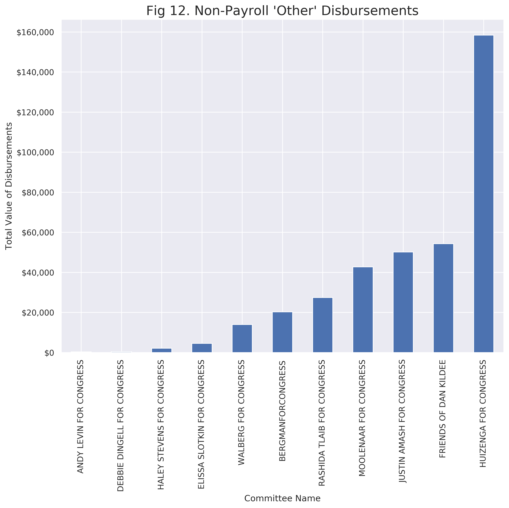


### Staff "other" disbursements, Grouped by Committee Name with Full Disbursement Description


```python
_ = non_payroll_other_df.groupby(['committee_name','disbursement_description']).agg({"disbursement_amount": ["count", "sum"]})
_.columns = ["_".join(x) for x in _.columns.ravel()]
_.columns=[c.replace("_amount", "") for c in _.columns]
_
```


<div>
<style scoped>
    .dataframe tbody tr th:only-of-type {
        vertical-align: middle;
    }

    .dataframe tbody tr th {
        vertical-align: top;
    }

    .dataframe thead th {
        text-align: right;
    }
</style>
<table border="1" class="dataframe">
  <thead>
    <tr style="text-align: right;">
      <th></th>
      <th></th>
      <th>disbursement_count</th>
      <th>disbursement_sum</th>
    </tr>
    <tr>
      <th>committee_name</th>
      <th>disbursement_description</th>
      <th></th>
      <th></th>
    </tr>
  </thead>
  <tbody>
    <tr>
      <th rowspan="2" valign="top">ANDY LEVIN FOR CONGRESS</th>
      <th>EVENT SUPPLIES</th>
      <td>1</td>
      <td>67.96</td>
    </tr>
    <tr>
      <th>OFFICE SUPPLY REIMBURSEMENT</th>
      <td>1</td>
      <td>212.00</td>
    </tr>
    <tr>
      <th rowspan="7" valign="top">BERGMANFORCONGRESS</th>
      <th>CAMPAIGN CONSULTING</th>
      <td>1</td>
      <td>2000.00</td>
    </tr>
    <tr>
      <th>FIELD CONSULTING</th>
      <td>6</td>
      <td>10095.00</td>
    </tr>
    <tr>
      <th>NO ITEMIZATION NECESSARY</th>
      <td>1</td>
      <td>120.41</td>
    </tr>
    <tr>
      <th>SEE BELOW</th>
      <td>2</td>
      <td>1366.79</td>
    </tr>
    <tr>
      <th>SEE MEMO ENTRIES</th>
      <td>5</td>
      <td>1116.48</td>
    </tr>
    <tr>
      <th>SEE MEMO ENTRY</th>
      <td>4</td>
      <td>559.68</td>
    </tr>
    <tr>
      <th>STRATEGY CONSULTING</th>
      <td>2</td>
      <td>5000.00</td>
    </tr>
    <tr>
      <th>DEBBIE DINGELL FOR CONGRESS</th>
      <th>REIMBURSEMENT</th>
      <td>1</td>
      <td>407.62</td>
    </tr>
    <tr>
      <th rowspan="5" valign="top">ELISSA SLOTKIN FOR CONGRESS</th>
      <th>MILEAGE REIMBURSEMENT</th>
      <td>6</td>
      <td>1086.90</td>
    </tr>
    <tr>
      <th>REIMBURSEMENT</th>
      <td>4</td>
      <td>1749.81</td>
    </tr>
    <tr>
      <th>REIMBURSEMENT (VENDORS OVER $200 AGGREGATE BELOW)</th>
      <td>2</td>
      <td>1048.71</td>
    </tr>
    <tr>
      <th>REIMBURSEMENT (VENDORS THAT AGGREGATE OVER $200 APPEAR BELOW)</th>
      <td>1</td>
      <td>443.91</td>
    </tr>
    <tr>
      <th>REIMBURSEMENT (VENDORS THAT AGGREGATE OVER $200 LISTED BELOW)</th>
      <td>1</td>
      <td>184.14</td>
    </tr>
    <tr>
      <th rowspan="9" valign="top">FRIENDS OF DAN KILDEE</th>
      <th>ADVANCE FOR PURCHASE OF FOOD FOR FUNDRAISER</th>
      <td>1</td>
      <td>434.00</td>
    </tr>
    <tr>
      <th>CONTRACT CONSULTING</th>
      <td>2</td>
      <td>3720.00</td>
    </tr>
    <tr>
      <th>CONTRACT PROFESSIONAL SERVICES</th>
      <td>1</td>
      <td>706.24</td>
    </tr>
    <tr>
      <th>FUEL REIMBURSEMENT FOR CAMPAIGN APPEARANCES</th>
      <td>1</td>
      <td>181.30</td>
    </tr>
    <tr>
      <th>FUNDRAISER SUPPLIES</th>
      <td>1</td>
      <td>45.96</td>
    </tr>
    <tr>
      <th>FUNDRAISING CONSULTING</th>
      <td>14</td>
      <td>39166.00</td>
    </tr>
    <tr>
      <th>FUNDRAISING EMPLOYEE</th>
      <td>1</td>
      <td>9841.76</td>
    </tr>
    <tr>
      <th>OFFICE SUPPLY REIMBURSEMENT</th>
      <td>1</td>
      <td>219.44</td>
    </tr>
    <tr>
      <th>SUPPLIES</th>
      <td>1</td>
      <td>23.97</td>
    </tr>
    <tr>
      <th rowspan="2" valign="top">HALEY STEVENS FOR CONGRESS</th>
      <th>MILEAGE</th>
      <td>1</td>
      <td>327.70</td>
    </tr>
    <tr>
      <th>REIMBURSEMENT - TRAVEL</th>
      <td>1</td>
      <td>1775.56</td>
    </tr>
    <tr>
      <th rowspan="19" valign="top">HUIZENGA FOR CONGRESS</th>
      <th>ADMINISTRATION SERVICES</th>
      <td>5</td>
      <td>2500.00</td>
    </tr>
    <tr>
      <th>CAMPAIGN BREAKFAST MEETING</th>
      <td>1</td>
      <td>39.47</td>
    </tr>
    <tr>
      <th>CAMPAIGN CONSULTANT</th>
      <td>51</td>
      <td>30837.98</td>
    </tr>
    <tr>
      <th>CAMPAIGN CONSULTING</th>
      <td>3</td>
      <td>3000.00</td>
    </tr>
    <tr>
      <th>CAMPAIGN EVENT: MILEAGE REIMBURSEMENT</th>
      <td>1</td>
      <td>229.71</td>
    </tr>
    <tr>
      <th>CONSULTING SERVICES</th>
      <td>4</td>
      <td>17354.10</td>
    </tr>
    <tr>
      <th>FIELD CONSULTANT</th>
      <td>1</td>
      <td>500.00</td>
    </tr>
    <tr>
      <th>FIELD CONSULTING</th>
      <td>12</td>
      <td>9055.00</td>
    </tr>
    <tr>
      <th>FUNDRAISING CONSULTING</th>
      <td>8</td>
      <td>8966.32</td>
    </tr>
    <tr>
      <th>LABOR FOR CAMPAIGN WORKER</th>
      <td>1</td>
      <td>750.00</td>
    </tr>
    <tr>
      <th>MILEAGE REIMBURSEMENT</th>
      <td>66</td>
      <td>33288.11</td>
    </tr>
    <tr>
      <th>PERFORMANCE BONUS</th>
      <td>1</td>
      <td>1000.00</td>
    </tr>
    <tr>
      <th>REFRESHMENTS FOR CAMPAIGN EVENT</th>
      <td>1</td>
      <td>1100.00</td>
    </tr>
    <tr>
      <th>REIMBURSEMENT FOR MILEAGE</th>
      <td>2</td>
      <td>454.09</td>
    </tr>
    <tr>
      <th>SEE BELOW</th>
      <td>10</td>
      <td>21454.54</td>
    </tr>
    <tr>
      <th>STRATEGY CONSULTING</th>
      <td>11</td>
      <td>13750.00</td>
    </tr>
    <tr>
      <th>TAXI &amp; FED EX SUPPLIES REIMBUR</th>
      <td>1</td>
      <td>259.99</td>
    </tr>
    <tr>
      <th>TRAVEL: MILEAGE REIMBURSEMENT</th>
      <td>27</td>
      <td>11867.47</td>
    </tr>
    <tr>
      <th>nan</th>
      <td>1</td>
      <td>2000.00</td>
    </tr>
    <tr>
      <th rowspan="5" valign="top">JUSTIN AMASH FOR CONGRESS</th>
      <th>ADMINISTRATIVE CONSULTING</th>
      <td>14</td>
      <td>43749.66</td>
    </tr>
    <tr>
      <th>ADMINISTRATIVE/STRATEGIC SUPPORT</th>
      <td>2</td>
      <td>3436.03</td>
    </tr>
    <tr>
      <th>ADMINSTRATIVE/STRATEGIC SUPPORT</th>
      <td>2</td>
      <td>2872.06</td>
    </tr>
    <tr>
      <th>REIMBURSEMENT FOR TONER</th>
      <td>1</td>
      <td>116.58</td>
    </tr>
    <tr>
      <th>TRAVEL</th>
      <td>1</td>
      <td>12.50</td>
    </tr>
    <tr>
      <th rowspan="6" valign="top">MOOLENAAR FOR CONGRESS</th>
      <th>MILEAGE</th>
      <td>39</td>
      <td>14591.30</td>
    </tr>
    <tr>
      <th>MILEAGE REIMBURSEMENT</th>
      <td>19</td>
      <td>5404.05</td>
    </tr>
    <tr>
      <th>MILEAGE, EQUIPMENT - ITEMIZED</th>
      <td>1</td>
      <td>526.40</td>
    </tr>
    <tr>
      <th>MILEAGE, EXP. REIMBURSEMENT - ITEMIZED</th>
      <td>3</td>
      <td>525.25</td>
    </tr>
    <tr>
      <th>SUPPLIES - ITEMIZED</th>
      <td>1</td>
      <td>149.60</td>
    </tr>
    <tr>
      <th>WAGES</th>
      <td>16</td>
      <td>21555.25</td>
    </tr>
    <tr>
      <th rowspan="7" valign="top">RASHIDA TLAIB FOR CONGRESS</th>
      <th>CAMPAIGN FINANCE DIRECTOR PAY 2/12 TO 2/28</th>
      <td>1</td>
      <td>2550.00</td>
    </tr>
    <tr>
      <th>FINANCE DIRECTOR PAY</th>
      <td>1</td>
      <td>675.00</td>
    </tr>
    <tr>
      <th>FUNDRAISING CONSULTATION</th>
      <td>2</td>
      <td>16000.00</td>
    </tr>
    <tr>
      <th>REIMBURSEMENT</th>
      <td>1</td>
      <td>1359.35</td>
    </tr>
    <tr>
      <th>REIMBURSEMENT - TRAVEL</th>
      <td>1</td>
      <td>492.40</td>
    </tr>
    <tr>
      <th>REIMBURSEMENT FROM TRAVEL</th>
      <td>1</td>
      <td>1196.33</td>
    </tr>
    <tr>
      <th>RESEARCH</th>
      <td>1</td>
      <td>5125.00</td>
    </tr>
    <tr>
      <th rowspan="8" valign="top">WALBERG FOR CONGRESS</th>
      <th>MILEAGE</th>
      <td>13</td>
      <td>7076.30</td>
    </tr>
    <tr>
      <th>OTHER: REIMBURSEMENT - FOOD/SUPPLIES</th>
      <td>1</td>
      <td>573.65</td>
    </tr>
    <tr>
      <th>OTHER: REIMBURSEMENT - INSURANCE</th>
      <td>1</td>
      <td>74.21</td>
    </tr>
    <tr>
      <th>OTHER: REIMBURSEMENT - SUPPLIES</th>
      <td>6</td>
      <td>1371.93</td>
    </tr>
    <tr>
      <th>OTHER: REIMBURSEMENT - SUPPLIES/FOOD</th>
      <td>3</td>
      <td>960.58</td>
    </tr>
    <tr>
      <th>OTHER: REIMBURSEMENT - TRAVEL</th>
      <td>1</td>
      <td>238.71</td>
    </tr>
    <tr>
      <th>REIMBURSEMENT - SUPPLIES, INSURANCE</th>
      <td>1</td>
      <td>304.40</td>
    </tr>
    <tr>
      <th>TRAVEL: MILEAGE</th>
      <td>9</td>
      <td>3333.90</td>
    </tr>
  </tbody>
</table>
</div>


